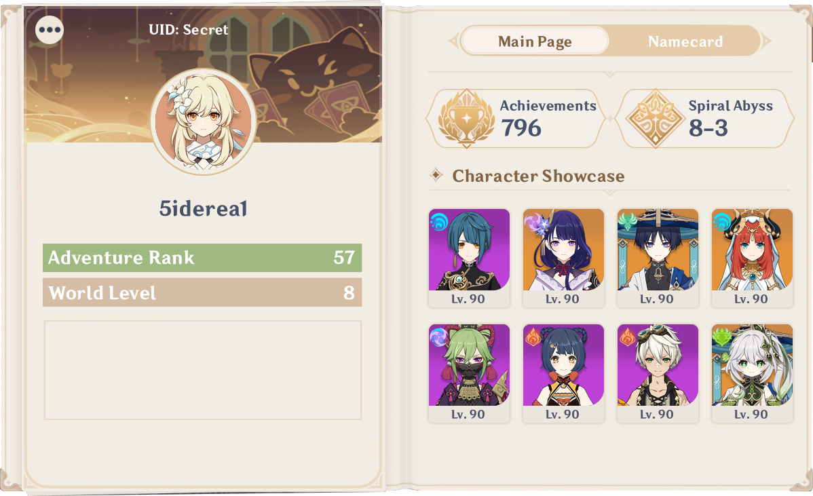
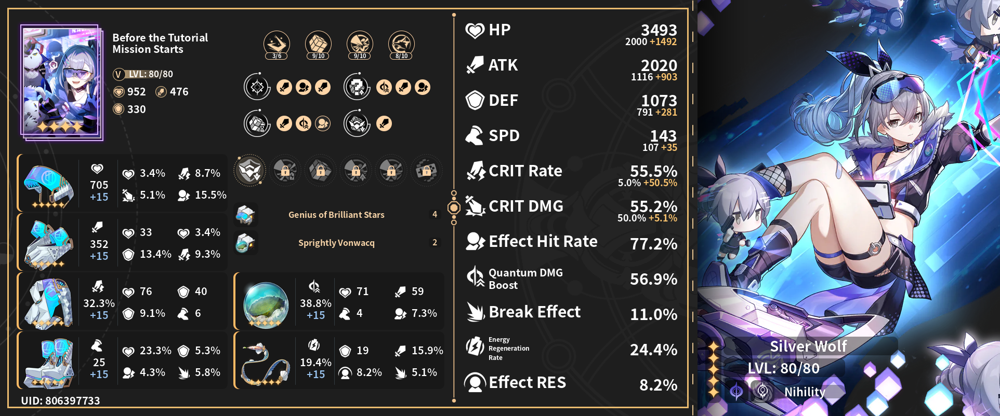
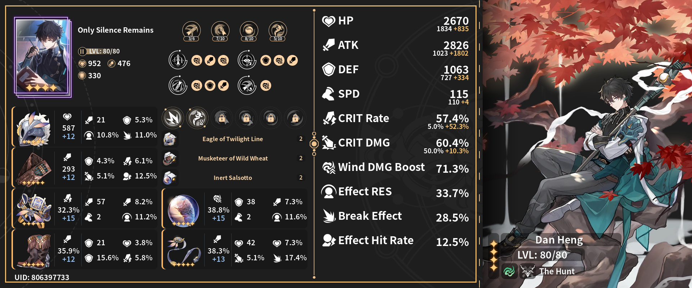
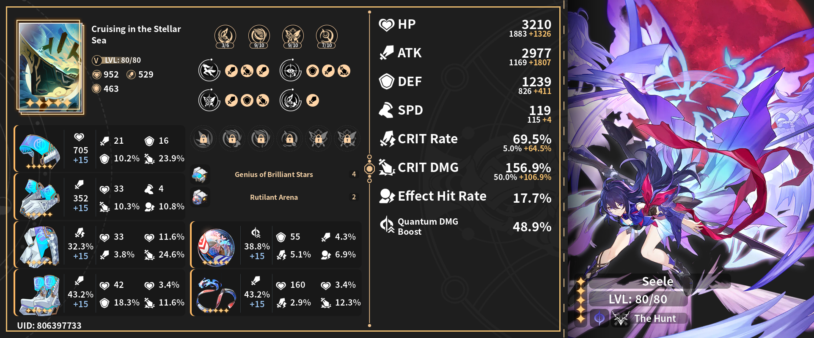
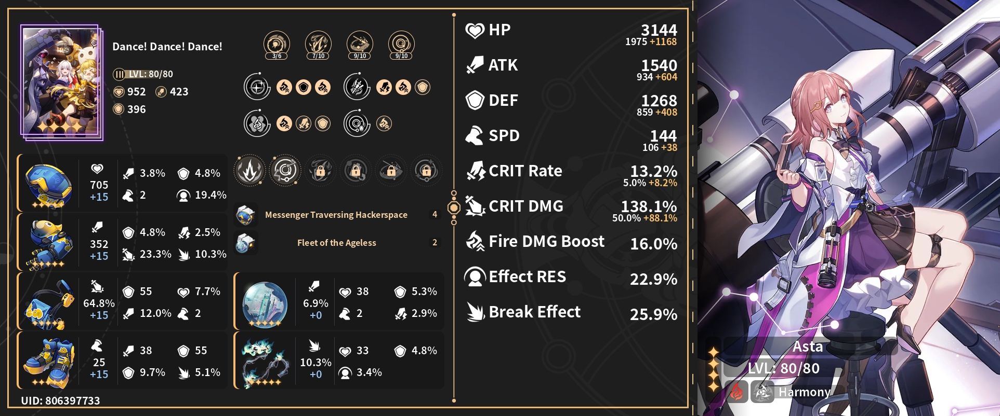

<h1 align="center">原神 啟動</h1>
<h3 align="center">🕒 更新於 <u>Oct 25, 2023 13:23 +0700</u></h3>
 

  

    星鐵
  

  

    <h2>個人檔案</h2>
    
  

  

    <h2> 每日獎勵</h2>
    <table>
      <tr>
        <td>已領取總獎勵</td>
        <td>25</td>
      </tr>
      <tr>
        <td>上次領取獎勵</td>
        <td>
          1 x
          
          一次性動力臂
        </td>
      </tr>
    </table>
  

  

    <h2>
      
      統計資料
    </h2>
    <table>
      <tr>
        <td>Days Active</td>
        <td>168</td>
      </tr>
      <tr>
        <td>Total Avatar</td>
        <td>25</td>
      </tr>
      <tr>
        <td>Total Achievement</td>
        <td>352</td>
      </tr>
      <tr>
        <td>開啟寶箱數</td>
        <td>360</td>
      </tr>
    </table>
  

  

    <h2> 日記</h2>
    <table>
      <tr>
        <td>
          已賺取星瓊數
        </td>
        <td>11188 (rate -21)</td>
      </tr>
      <tr>
        <td>
          已賺取通票和專票數
        </td>
        <td>34 (rate -12)</td>
      </tr>
      <tr>
        <td>類別</td>
        <td>
          每日活躍: 3600 (32%) 冒險獎勵: 2645 (23%) 活動獎勵: 1700
          (15%) 忘卻之庭獎勵: 1400 (12%) 模擬宇宙獎勵: 1130 (10%) 郵件獎勵:
          710 (6%) 其他: 3 (2%) 
        </td>
      </tr>
    </table>
  

  

    <h2>渾沌回憶</h2>
    <table>
      <tr>
        <td>賽季</td>
        <td>1004</td>
      </tr>
      <tr>
        <td>最深層數</td>
        <td>生劫火劫其十</td>
      </tr>
      <tr>
        <td>總戰鬥次數</td>
        <td>16</td>
      </tr>
      <tr>
        <td>總星數</td>
        <td>30</td>
      </tr>
    </table>
  

  

    <h2>
      
      角色
    </h2>
    

      
<b>開拓者 </b>

       
      <table>
        <tr>
          <th><h3>開拓者</h3></th>
          <th><h3></h3></th>
        </tr>
        <tr>
          <td>
            

              
            

          </td>
          <td>
            

          </td>
        </tr>
        <tr>
          <td>
            <table>
              <tr>
                <td>星級</td>
                <td>★★★★★</td>
              </tr>
              <tr>
                <td>元素</td>
                <td>
                  
                </td>
              </tr>
              <tr>
                <td>等級</td>
                <td>80</td>
              </tr>
              <tr>
                <td>星魂</td>
                <td>6</td>
              </tr>
              <tr>
                <td>遺器</td>
                <td>
                  
                  快槍手的野穗氈帽 
                  怪盜的繪紋手套 
                  快槍手的獵風披肩 
                  快槍手的鉚釘馬靴 
                </td>
              </tr>
              <tr>
                <td>飾品</td>
                <td>
                  
                  薩爾索圖的移動城市 
                  薩爾索圖的晨昏界線 
                </td>
              </tr>
            </table>
          </td>
          <td valign="top">
            <table>
              <tr>
                <td>名稱</td>
                <td></td>
              </tr>
              <tr>
                <td>等級</td>
                <td></td>
              </tr>
              <tr>
                <td>疊影</td>
                <td></td>
              </tr>
            </table>
          </td>
        </tr>
      </table>
    

    

      
<b>白露 </b>

       
      <table>
        <tr>
          <th><h3>白露</h3></th>
          <th><h3>一場術後對話</h3></th>
        </tr>
        <tr>
          <td>
            

              
            

          </td>
          <td>
            

              
            

          </td>
        </tr>
        <tr>
          <td>
            <table>
              <tr>
                <td>星級</td>
                <td>★★★★★</td>
              </tr>
              <tr>
                <td>元素</td>
                <td>
                  
                </td>
              </tr>
              <tr>
                <td>等級</td>
                <td>80</td>
              </tr>
              <tr>
                <td>星魂</td>
                <td>0</td>
              </tr>
              <tr>
                <td>遺器</td>
                <td>
                  
                  過客的逢春木簪 
                  過客的遊龍臂韝 
                  過客的殘繡風衣 
                  過客的冥途遊履 
                </td>
              </tr>
              <tr>
                <td>飾品</td>
                <td>
                  
                  羅浮仙舟的天外樓船 
                  羅浮仙舟的建木枝蔓 
                </td>
              </tr>
            </table>
          </td>
          <td valign="top">
            <table>
              <tr>
                <td>名稱</td>
                <td>一場術後對話</td>
              </tr>
              <tr>
                <td>等級</td>
                <td>80</td>
              </tr>
              <tr>
                <td>疊影</td>
                <td>2</td>
              </tr>
            </table>
          </td>
        </tr>
      </table>
    

    

      
<b>符玄 </b>

       
      <table>
        <tr>
          <th><h3>符玄</h3></th>
          <th><h3>記憶的質料</h3></th>
        </tr>
        <tr>
          <td>
            

              
            

          </td>
          <td>
            

              
            

          </td>
        </tr>
        <tr>
          <td>
            <table>
              <tr>
                <td>星級</td>
                <td>★★★★★</td>
              </tr>
              <tr>
                <td>元素</td>
                <td>
                  
                </td>
              </tr>
              <tr>
                <td>等級</td>
                <td>80</td>
              </tr>
              <tr>
                <td>星魂</td>
                <td>0</td>
              </tr>
              <tr>
                <td>遺器</td>
                <td>
                  
                  信使的全像目鏡 
                  信使的百變義手 
                  蒔者的承露羽衣 
                  蒔者的天人絲履 
                </td>
              </tr>
              <tr>
                <td>飾品</td>
                <td>
                  
                  羅浮仙舟的天外樓船 
                  羅浮仙舟的建木枝蔓 
                </td>
              </tr>
            </table>
          </td>
          <td valign="top">
            <table>
              <tr>
                <td>名稱</td>
                <td>記憶的質料</td>
              </tr>
              <tr>
                <td>等級</td>
                <td>80</td>
              </tr>
              <tr>
                <td>疊影</td>
                <td>1</td>
              </tr>
            </table>
          </td>
        </tr>
      </table>
    

    

      
<b>羅剎 </b>

       
      <table>
        <tr>
          <th><h3>羅剎</h3></th>
          <th><h3>等價交換</h3></th>
        </tr>
        <tr>
          <td>
            

              
            

          </td>
          <td>
            

              
            

          </td>
        </tr>
        <tr>
          <td>
            <table>
              <tr>
                <td>星級</td>
                <td>★★★★★</td>
              </tr>
              <tr>
                <td>元素</td>
                <td>
                  
                </td>
              </tr>
              <tr>
                <td>等級</td>
                <td>80</td>
              </tr>
              <tr>
                <td>星魂</td>
                <td>0</td>
              </tr>
              <tr>
                <td>遺器</td>
                <td>
                  
                  過客的逢春木簪 
                  過客的遊龍臂韝 
                  快槍手的獵風披肩 
                  快槍手的鉚釘馬靴 
                </td>
              </tr>
              <tr>
                <td>飾品</td>
                <td>
                  
                  羅浮仙舟的天外樓船 
                  羅浮仙舟的建木枝蔓 
                </td>
              </tr>
            </table>
          </td>
          <td valign="top">
            <table>
              <tr>
                <td>名稱</td>
                <td>等價交換</td>
              </tr>
              <tr>
                <td>等級</td>
                <td>80</td>
              </tr>
              <tr>
                <td>疊影</td>
                <td>5</td>
              </tr>
            </table>
          </td>
        </tr>
      </table>
    

    

      
<b>希兒 </b>

       
      <table>
        <tr>
          <th><h3>希兒</h3></th>
          <th><h3>星海巡航</h3></th>
        </tr>
        <tr>
          <td>
            

              
            

          </td>
          <td>
            

              
            

          </td>
        </tr>
        <tr>
          <td>
            <table>
              <tr>
                <td>星級</td>
                <td>★★★★★</td>
              </tr>
              <tr>
                <td>元素</td>
                <td>
                  
                </td>
              </tr>
              <tr>
                <td>等級</td>
                <td>80</td>
              </tr>
              <tr>
                <td>星魂</td>
                <td>0</td>
              </tr>
              <tr>
                <td>遺器</td>
                <td>
                  
                  天才的超距遙感 
                  天才的頻變捕手 
                  天才的元域深潛 
                  天才的引力漫步 
                </td>
              </tr>
              <tr>
                <td>飾品</td>
                <td>
                  
                  泰科銨的雷射球場 
                  泰科銨的弧光賽道 
                </td>
              </tr>
            </table>
          </td>
          <td valign="top">
            <table>
              <tr>
                <td>名稱</td>
                <td>星海巡航</td>
              </tr>
              <tr>
                <td>等級</td>
                <td>80</td>
              </tr>
              <tr>
                <td>疊影</td>
                <td>5</td>
              </tr>
            </table>
          </td>
        </tr>
      </table>
    

    

      
<b>布洛妮婭 </b>

       
      <table>
        <tr>
          <th><h3>布洛妮婭</h3></th>
          <th><h3>過往未來</h3></th>
        </tr>
        <tr>
          <td>
            

              
            

          </td>
          <td>
            

              
            

          </td>
        </tr>
        <tr>
          <td>
            <table>
              <tr>
                <td>星級</td>
                <td>★★★★★</td>
              </tr>
              <tr>
                <td>元素</td>
                <td>
                  
                </td>
              </tr>
              <tr>
                <td>等級</td>
                <td>80</td>
              </tr>
              <tr>
                <td>星魂</td>
                <td>0</td>
              </tr>
              <tr>
                <td>遺器</td>
                <td>
                  
                  蒔者的復明義眼 
                  信使的百變義手 
                  樂團的釘刺皮衣 
                  天才的引力漫步 
                </td>
              </tr>
              <tr>
                <td>飾品</td>
                <td>
                  
                  羅浮仙舟的天外樓船 
                  羅浮仙舟的建木枝蔓 
                </td>
              </tr>
            </table>
          </td>
          <td valign="top">
            <table>
              <tr>
                <td>名稱</td>
                <td>過往未來</td>
              </tr>
              <tr>
                <td>等級</td>
                <td>80</td>
              </tr>
              <tr>
                <td>疊影</td>
                <td>5</td>
              </tr>
            </table>
          </td>
        </tr>
      </table>
    

    

      
<b>銀狼 </b>

       
      <table>
        <tr>
          <th><h3>銀狼</h3></th>
          <th><h3>新手任務開始前</h3></th>
        </tr>
        <tr>
          <td>
            

              
            

          </td>
          <td>
            

              
            

          </td>
        </tr>
        <tr>
          <td>
            <table>
              <tr>
                <td>星級</td>
                <td>★★★★★</td>
              </tr>
              <tr>
                <td>元素</td>
                <td>
                  
                </td>
              </tr>
              <tr>
                <td>等級</td>
                <td>80</td>
              </tr>
              <tr>
                <td>星魂</td>
                <td>1</td>
              </tr>
              <tr>
                <td>遺器</td>
                <td>
                  
                  天才的超距遙感 
                  天才的頻變捕手 
                  天才的元域深潛 
                  天才的引力漫步 
                </td>
              </tr>
              <tr>
                <td>飾品</td>
                <td>
                  
                  翁瓦克的誕生之島 
                  翁瓦克的環島海岸 
                </td>
              </tr>
            </table>
          </td>
          <td valign="top">
            <table>
              <tr>
                <td>名稱</td>
                <td>新手任務開始前</td>
              </tr>
              <tr>
                <td>等級</td>
                <td>80</td>
              </tr>
              <tr>
                <td>疊影</td>
                <td>5</td>
              </tr>
            </table>
          </td>
        </tr>
      </table>
    

    

      
<b>卡芙卡 </b>

       
      <table>
        <tr>
          <th><h3>卡芙卡</h3></th>
          <th><h3>晚安與睡顏</h3></th>
        </tr>
        <tr>
          <td>
            

              
            

          </td>
          <td>
            

              
            

          </td>
        </tr>
        <tr>
          <td>
            <table>
              <tr>
                <td>星級</td>
                <td>★★★★★</td>
              </tr>
              <tr>
                <td>元素</td>
                <td>
                  
                </td>
              </tr>
              <tr>
                <td>等級</td>
                <td>80</td>
              </tr>
              <tr>
                <td>星魂</td>
                <td>0</td>
              </tr>
              <tr>
                <td>遺器</td>
                <td>
                  
                  樂團的偏光墨鏡 
                  樂團的巡演手繩 
                  樂團的釘刺皮衣 
                  樂團的鉚釘短靴 
                </td>
              </tr>
              <tr>
                <td>飾品</td>
                <td>
                  
                  「黑塔」的太空站 
                  「黑塔」的漫歷軌跡 
                </td>
              </tr>
            </table>
          </td>
          <td valign="top">
            <table>
              <tr>
                <td>名稱</td>
                <td>晚安與睡顏</td>
              </tr>
              <tr>
                <td>等級</td>
                <td>80</td>
              </tr>
              <tr>
                <td>疊影</td>
                <td>4</td>
              </tr>
            </table>
          </td>
        </tr>
      </table>
    

    

      
<b>素裳 </b>

       
      <table>
        <tr>
          <th><h3>素裳</h3></th>
          <th><h3>論劍</h3></th>
        </tr>
        <tr>
          <td>
            

              
            

          </td>
          <td>
            

              
            

          </td>
        </tr>
        <tr>
          <td>
            <table>
              <tr>
                <td>星級</td>
                <td>★★★★</td>
              </tr>
              <tr>
                <td>元素</td>
                <td>
                  
                </td>
              </tr>
              <tr>
                <td>等級</td>
                <td>80</td>
              </tr>
              <tr>
                <td>星魂</td>
                <td>6</td>
              </tr>
              <tr>
                <td>遺器</td>
                <td>
                  
                  拳王的冠軍護頭 
                  怪盜的繪紋手套 
                  怪盜的纖鋼爪鉤 
                  拳王的弧步戰靴 
                </td>
              </tr>
              <tr>
                <td>飾品</td>
                <td>
                  
                  薩爾索圖的移動城市 
                  薩爾索圖的晨昏界線 
                </td>
              </tr>
            </table>
          </td>
          <td valign="top">
            <table>
              <tr>
                <td>名稱</td>
                <td>論劍</td>
              </tr>
              <tr>
                <td>等級</td>
                <td>80</td>
              </tr>
              <tr>
                <td>疊影</td>
                <td>2</td>
              </tr>
            </table>
          </td>
        </tr>
      </table>
    

    

      
<b>青雀 </b>

       
      <table>
        <tr>
          <th><h3>青雀</h3></th>
          <th><h3>銀河鐵道之夜</h3></th>
        </tr>
        <tr>
          <td>
            

              
            

          </td>
          <td>
            

              
            

          </td>
        </tr>
        <tr>
          <td>
            <table>
              <tr>
                <td>星級</td>
                <td>★★★★</td>
              </tr>
              <tr>
                <td>元素</td>
                <td>
                  
                </td>
              </tr>
              <tr>
                <td>等級</td>
                <td>80</td>
              </tr>
              <tr>
                <td>星魂</td>
                <td>5</td>
              </tr>
              <tr>
                <td>遺器</td>
                <td>
                  
                  天才的超距遙感 
                  天才的頻變捕手 
                  天才的元域深潛 
                  天才的引力漫步 
                </td>
              </tr>
              <tr>
                <td>飾品</td>
                <td>
                  
                  薩爾索圖的移動城市 
                  薩爾索圖的晨昏界線 
                </td>
              </tr>
            </table>
          </td>
          <td valign="top">
            <table>
              <tr>
                <td>名稱</td>
                <td>銀河鐵道之夜</td>
              </tr>
              <tr>
                <td>等級</td>
                <td>80</td>
              </tr>
              <tr>
                <td>疊影</td>
                <td>1</td>
              </tr>
            </table>
          </td>
        </tr>
      </table>
    

    

      
<b>盧卡 </b>

       
      <table>
        <tr>
          <th><h3>盧卡</h3></th>
          <th><h3>延長記號</h3></th>
        </tr>
        <tr>
          <td>
            

              
            

          </td>
          <td>
            

              
            

          </td>
        </tr>
        <tr>
          <td>
            <table>
              <tr>
                <td>星級</td>
                <td>★★★★</td>
              </tr>
              <tr>
                <td>元素</td>
                <td>
                  
                </td>
              </tr>
              <tr>
                <td>等級</td>
                <td>80</td>
              </tr>
              <tr>
                <td>星魂</td>
                <td>2</td>
              </tr>
              <tr>
                <td>遺器</td>
                <td>
                  
                  拳王的冠軍護頭 
                  拳王的重炮拳套 
                  拳王的貼身護胸 
                  拳王的弧步戰靴 
                </td>
              </tr>
              <tr>
                <td>飾品</td>
                <td>
                  
                  「黑塔」的太空站 
                  「黑塔」的漫歷軌跡 
                </td>
              </tr>
            </table>
          </td>
          <td valign="top">
            <table>
              <tr>
                <td>名稱</td>
                <td>延長記號</td>
              </tr>
              <tr>
                <td>等級</td>
                <td>80</td>
              </tr>
              <tr>
                <td>疊影</td>
                <td>3</td>
              </tr>
            </table>
          </td>
        </tr>
      </table>
    

    

      
<b>玲可 </b>

       
      <table>
        <tr>
          <th><h3>玲可</h3></th>
          <th><h3></h3></th>
        </tr>
        <tr>
          <td>
            

              
            

          </td>
          <td>
            

          </td>
        </tr>
        <tr>
          <td>
            <table>
              <tr>
                <td>星級</td>
                <td>★★★★</td>
              </tr>
              <tr>
                <td>元素</td>
                <td>
                  
                </td>
              </tr>
              <tr>
                <td>等級</td>
                <td>80</td>
              </tr>
              <tr>
                <td>星魂</td>
                <td>2</td>
              </tr>
              <tr>
                <td>遺器</td>
                <td></td>
              </tr>
            </table>
          </td>
          <td valign="top">
            <table>
              <tr>
                <td>名稱</td>
                <td></td>
              </tr>
              <tr>
                <td>等級</td>
                <td></td>
              </tr>
              <tr>
                <td>疊影</td>
                <td></td>
              </tr>
            </table>
          </td>
        </tr>
      </table>
    

    

      
<b>佩拉 </b>

       
      <table>
        <tr>
          <th><h3>佩拉</h3></th>
          <th><h3>決心如汗珠般閃耀</h3></th>
        </tr>
        <tr>
          <td>
            

              
            

          </td>
          <td>
            

              
            

          </td>
        </tr>
        <tr>
          <td>
            <table>
              <tr>
                <td>星級</td>
                <td>★★★★</td>
              </tr>
              <tr>
                <td>元素</td>
                <td>
                  
                </td>
              </tr>
              <tr>
                <td>等級</td>
                <td>80</td>
              </tr>
              <tr>
                <td>星魂</td>
                <td>6</td>
              </tr>
              <tr>
                <td>遺器</td>
                <td>
                  
                  快槍手的野穗氈帽 
                  快槍手的粗革手套 
                  快槍手的獵風披肩 
                  快槍手的鉚釘馬靴 
                </td>
              </tr>
              <tr>
                <td>飾品</td>
                <td>
                  
                  翁瓦克的誕生之島 
                  翁瓦克的環島海岸 
                </td>
              </tr>
            </table>
          </td>
          <td valign="top">
            <table>
              <tr>
                <td>名稱</td>
                <td>決心如汗珠般閃耀</td>
              </tr>
              <tr>
                <td>等級</td>
                <td>80</td>
              </tr>
              <tr>
                <td>疊影</td>
                <td>1</td>
              </tr>
            </table>
          </td>
        </tr>
      </table>
    

    

      
<b>艾絲妲 </b>

       
      <table>
        <tr>
          <th><h3>艾絲妲</h3></th>
          <th><h3>舞！舞！舞！</h3></th>
        </tr>
        <tr>
          <td>
            

              
            

          </td>
          <td>
            

              
            

          </td>
        </tr>
        <tr>
          <td>
            <table>
              <tr>
                <td>星級</td>
                <td>★★★★</td>
              </tr>
              <tr>
                <td>元素</td>
                <td>
                  
                </td>
              </tr>
              <tr>
                <td>等級</td>
                <td>80</td>
              </tr>
              <tr>
                <td>星魂</td>
                <td>2</td>
              </tr>
              <tr>
                <td>遺器</td>
                <td>
                  
                  信使的全像目鏡 
                  信使的百變義手 
                  信使的密信單肩包 
                  信使的酷跑板鞋 
                </td>
              </tr>
              <tr>
                <td>飾品</td>
                <td>
                  
                  羅浮仙舟的天外樓船 
                  羅浮仙舟的建木枝蔓 
                </td>
              </tr>
            </table>
          </td>
          <td valign="top">
            <table>
              <tr>
                <td>名稱</td>
                <td>舞！舞！舞！</td>
              </tr>
              <tr>
                <td>等級</td>
                <td>80</td>
              </tr>
              <tr>
                <td>疊影</td>
                <td>3</td>
              </tr>
            </table>
          </td>
        </tr>
      </table>
    

    

      
<b>丹恆 </b>

       
      <table>
        <tr>
          <th><h3>丹恆</h3></th>
          <th><h3>唯有沉默</h3></th>
        </tr>
        <tr>
          <td>
            

              
            

          </td>
          <td>
            

              
            

          </td>
        </tr>
        <tr>
          <td>
            <table>
              <tr>
                <td>星級</td>
                <td>★★★★</td>
              </tr>
              <tr>
                <td>元素</td>
                <td>
                  
                </td>
              </tr>
              <tr>
                <td>等級</td>
                <td>80</td>
              </tr>
              <tr>
                <td>星魂</td>
                <td>2</td>
              </tr>
              <tr>
                <td>遺器</td>
                <td>
                  
                  翔鷹的長喙頭盔 
                  快槍手的粗革手套 
                  翔鷹的翼裝束帶 
                  快槍手的鉚釘馬靴 
                </td>
              </tr>
              <tr>
                <td>飾品</td>
                <td>
                  
                  薩爾索圖的移動城市 
                  薩爾索圖的晨昏界線 
                </td>
              </tr>
            </table>
          </td>
          <td valign="top">
            <table>
              <tr>
                <td>名稱</td>
                <td>唯有沉默</td>
              </tr>
              <tr>
                <td>等級</td>
                <td>80</td>
              </tr>
              <tr>
                <td>疊影</td>
                <td>2</td>
              </tr>
            </table>
          </td>
        </tr>
      </table>
    

    

      
<b>傑帕德 </b>

       
      <table>
        <tr>
          <th><h3>傑帕德</h3></th>
          <th><h3>餘生的第一天</h3></th>
        </tr>
        <tr>
          <td>
            

              
            

          </td>
          <td>
            

              
            

          </td>
        </tr>
        <tr>
          <td>
            <table>
              <tr>
                <td>星級</td>
                <td>★★★★★</td>
              </tr>
              <tr>
                <td>元素</td>
                <td>
                  
                </td>
              </tr>
              <tr>
                <td>等級</td>
                <td>70</td>
              </tr>
              <tr>
                <td>星魂</td>
                <td>1</td>
              </tr>
              <tr>
                <td>遺器</td>
                <td>
                  
                  聖騎的寬恕盔面 
                  聖騎的沉默誓環 
                  聖騎的肅穆胸甲 
                  聖騎的秩序鐵靴 
                </td>
              </tr>
              <tr>
                <td>飾品</td>
                <td>
                  
                  貝洛伯格的存護堡壘 
                  貝洛伯格的鐵衛防線 
                </td>
              </tr>
            </table>
          </td>
          <td valign="top">
            <table>
              <tr>
                <td>名稱</td>
                <td>餘生的第一天</td>
              </tr>
              <tr>
                <td>等級</td>
                <td>70</td>
              </tr>
              <tr>
                <td>疊影</td>
                <td>2</td>
              </tr>
            </table>
          </td>
        </tr>
      </table>
    

    

      
<b>娜塔莎 </b>

       
      <table>
        <tr>
          <th><h3>娜塔莎</h3></th>
          <th><h3>蕃息</h3></th>
        </tr>
        <tr>
          <td>
            

              
            

          </td>
          <td>
            

              
            

          </td>
        </tr>
        <tr>
          <td>
            <table>
              <tr>
                <td>星級</td>
                <td>★★★★</td>
              </tr>
              <tr>
                <td>元素</td>
                <td>
                  
                </td>
              </tr>
              <tr>
                <td>等級</td>
                <td>59</td>
              </tr>
              <tr>
                <td>星魂</td>
                <td>6</td>
              </tr>
              <tr>
                <td>遺器</td>
                <td>
                  
                  怪盜的千人假面 
                  快槍手的粗革手套 
                </td>
              </tr>
              <tr>
                <td>飾品</td>
                <td>
                  
                  羅浮仙舟的建木枝蔓 
                </td>
              </tr>
            </table>
          </td>
          <td valign="top">
            <table>
              <tr>
                <td>名稱</td>
                <td>蕃息</td>
              </tr>
              <tr>
                <td>等級</td>
                <td>1</td>
              </tr>
              <tr>
                <td>疊影</td>
                <td>1</td>
              </tr>
            </table>
          </td>
        </tr>
      </table>
    

    

      
<b>虎克 </b>

       
      <table>
        <tr>
          <th><h3>虎克</h3></th>
          <th><h3>秘密誓心</h3></th>
        </tr>
        <tr>
          <td>
            

              
            

          </td>
          <td>
            

              
            

          </td>
        </tr>
        <tr>
          <td>
            <table>
              <tr>
                <td>星級</td>
                <td>★★★★</td>
              </tr>
              <tr>
                <td>元素</td>
                <td>
                  
                </td>
              </tr>
              <tr>
                <td>等級</td>
                <td>40</td>
              </tr>
              <tr>
                <td>星魂</td>
                <td>6</td>
              </tr>
              <tr>
                <td>遺器</td>
                <td></td>
              </tr>
            </table>
          </td>
          <td valign="top">
            <table>
              <tr>
                <td>名稱</td>
                <td>秘密誓心</td>
              </tr>
              <tr>
                <td>等級</td>
                <td>20</td>
              </tr>
              <tr>
                <td>疊影</td>
                <td>2</td>
              </tr>
            </table>
          </td>
        </tr>
      </table>
    

    

      
<b>黑塔 </b>

       
      <table>
        <tr>
          <th><h3>黑塔</h3></th>
          <th><h3></h3></th>
        </tr>
        <tr>
          <td>
            

              
            

          </td>
          <td>
            

          </td>
        </tr>
        <tr>
          <td>
            <table>
              <tr>
                <td>星級</td>
                <td>★★★★</td>
              </tr>
              <tr>
                <td>元素</td>
                <td>
                  
                </td>
              </tr>
              <tr>
                <td>等級</td>
                <td>40</td>
              </tr>
              <tr>
                <td>星魂</td>
                <td>5</td>
              </tr>
              <tr>
                <td>遺器</td>
                <td></td>
              </tr>
            </table>
          </td>
          <td valign="top">
            <table>
              <tr>
                <td>名稱</td>
                <td></td>
              </tr>
              <tr>
                <td>等級</td>
                <td></td>
              </tr>
              <tr>
                <td>疊影</td>
                <td></td>
              </tr>
            </table>
          </td>
        </tr>
      </table>
    

    

      
<b>希露瓦 </b>

       
      <table>
        <tr>
          <th><h3>希露瓦</h3></th>
          <th><h3>睿見</h3></th>
        </tr>
        <tr>
          <td>
            

              
            

          </td>
          <td>
            

              
            

          </td>
        </tr>
        <tr>
          <td>
            <table>
              <tr>
                <td>星級</td>
                <td>★★★★</td>
              </tr>
              <tr>
                <td>元素</td>
                <td>
                  
                </td>
              </tr>
              <tr>
                <td>等級</td>
                <td>30</td>
              </tr>
              <tr>
                <td>星魂</td>
                <td>6</td>
              </tr>
              <tr>
                <td>遺器</td>
                <td></td>
              </tr>
            </table>
          </td>
          <td valign="top">
            <table>
              <tr>
                <td>名稱</td>
                <td>睿見</td>
              </tr>
              <tr>
                <td>等級</td>
                <td>1</td>
              </tr>
              <tr>
                <td>疊影</td>
                <td>1</td>
              </tr>
            </table>
          </td>
        </tr>
      </table>
    

    

      
<b>三月七 </b>

       
      <table>
        <tr>
          <th><h3>三月七</h3></th>
          <th><h3>琥珀</h3></th>
        </tr>
        <tr>
          <td>
            

              
            

          </td>
          <td>
            

              
            

          </td>
        </tr>
        <tr>
          <td>
            <table>
              <tr>
                <td>星級</td>
                <td>★★★★</td>
              </tr>
              <tr>
                <td>元素</td>
                <td>
                  
                </td>
              </tr>
              <tr>
                <td>等級</td>
                <td>25</td>
              </tr>
              <tr>
                <td>星魂</td>
                <td>3</td>
              </tr>
              <tr>
                <td>遺器</td>
                <td></td>
              </tr>
            </table>
          </td>
          <td valign="top">
            <table>
              <tr>
                <td>名稱</td>
                <td>琥珀</td>
              </tr>
              <tr>
                <td>等級</td>
                <td>1</td>
              </tr>
              <tr>
                <td>疊影</td>
                <td>1</td>
              </tr>
            </table>
          </td>
        </tr>
      </table>
    

    

      
<b>姬子 </b>

       
      <table>
        <tr>
          <th><h3>姬子</h3></th>
          <th><h3></h3></th>
        </tr>
        <tr>
          <td>
            

              
            

          </td>
          <td>
            

          </td>
        </tr>
        <tr>
          <td>
            <table>
              <tr>
                <td>星級</td>
                <td>★★★★★</td>
              </tr>
              <tr>
                <td>元素</td>
                <td>
                  
                </td>
              </tr>
              <tr>
                <td>等級</td>
                <td>20</td>
              </tr>
              <tr>
                <td>星魂</td>
                <td>0</td>
              </tr>
              <tr>
                <td>遺器</td>
                <td></td>
              </tr>
            </table>
          </td>
          <td valign="top">
            <table>
              <tr>
                <td>名稱</td>
                <td></td>
              </tr>
              <tr>
                <td>等級</td>
                <td></td>
              </tr>
              <tr>
                <td>疊影</td>
                <td></td>
              </tr>
            </table>
          </td>
        </tr>
      </table>
    

    

      
<b>馭空 </b>

       
      <table>
        <tr>
          <th><h3>馭空</h3></th>
          <th><h3></h3></th>
        </tr>
        <tr>
          <td>
            

              
            

          </td>
          <td>
            

          </td>
        </tr>
        <tr>
          <td>
            <table>
              <tr>
                <td>星級</td>
                <td>★★★★</td>
              </tr>
              <tr>
                <td>元素</td>
                <td>
                  
                </td>
              </tr>
              <tr>
                <td>等級</td>
                <td>20</td>
              </tr>
              <tr>
                <td>星魂</td>
                <td>0</td>
              </tr>
              <tr>
                <td>遺器</td>
                <td></td>
              </tr>
            </table>
          </td>
          <td valign="top">
            <table>
              <tr>
                <td>名稱</td>
                <td></td>
              </tr>
              <tr>
                <td>等級</td>
                <td></td>
              </tr>
              <tr>
                <td>疊影</td>
                <td></td>
              </tr>
            </table>
          </td>
        </tr>
      </table>
    

    

      
<b>停雲 </b>

       
      <table>
        <tr>
          <th><h3>停雲</h3></th>
          <th><h3></h3></th>
        </tr>
        <tr>
          <td>
            

              
            

          </td>
          <td>
            

          </td>
        </tr>
        <tr>
          <td>
            <table>
              <tr>
                <td>星級</td>
                <td>★★★★</td>
              </tr>
              <tr>
                <td>元素</td>
                <td>
                  
                </td>
              </tr>
              <tr>
                <td>等級</td>
                <td>20</td>
              </tr>
              <tr>
                <td>星魂</td>
                <td>2</td>
              </tr>
              <tr>
                <td>遺器</td>
                <td></td>
              </tr>
            </table>
          </td>
          <td valign="top">
            <table>
              <tr>
                <td>名稱</td>
                <td></td>
              </tr>
              <tr>
                <td>等級</td>
                <td></td>
              </tr>
              <tr>
                <td>疊影</td>
                <td></td>
              </tr>
            </table>
          </td>
        </tr>
      </table>
    

    

      
<b>桑博 </b>

       
      <table>
        <tr>
          <th><h3>桑博</h3></th>
          <th><h3></h3></th>
        </tr>
        <tr>
          <td>
            

              
            

          </td>
          <td>
            

          </td>
        </tr>
        <tr>
          <td>
            <table>
              <tr>
                <td>星級</td>
                <td>★★★★</td>
              </tr>
              <tr>
                <td>元素</td>
                <td>
                  
                </td>
              </tr>
              <tr>
                <td>等級</td>
                <td>20</td>
              </tr>
              <tr>
                <td>星魂</td>
                <td>2</td>
              </tr>
              <tr>
                <td>遺器</td>
                <td></td>
              </tr>
            </table>
          </td>
          <td valign="top">
            <table>
              <tr>
                <td>名稱</td>
                <td></td>
              </tr>
              <tr>
                <td>等級</td>
                <td></td>
              </tr>
              <tr>
                <td>疊影</td>
                <td></td>
              </tr>
            </table>
          </td>
        </tr>
      </table>
    

  

  

    
    原神
  

  

    <h2>個人檔案</h2>
    
  

  

    <h2>
       每日獎勵
    </h2>
    <table>
      <tr>
        <td>已領取總獎勵</td>
        <td>25</td>
      </tr>
      <tr>
        <td>上次領取獎勵</td>
        <td>
          3 x
          
          大英雄的經驗
        </td>
      </tr>
    </table>
  

  

    <h2>
      
      統計資料
    </h2>
    <table>
      <tr>
        <td>成就達成數</td>
        <td>796</td>
      </tr>
      <tr>
        <td>活躍天數</td>
        <td>338</td>
      </tr>
      <tr>
        <td>Ta的角色</td>
        <td>47</td>
      </tr>
      <tr>
        <td>解鎖傳送點</td>
        <td>371</td>
      </tr>
      <tr>
        <td>風神瞳</td>
        <td>65</td>
      </tr>
      <tr>
        <td>岩神瞳</td>
        <td>130</td>
      </tr>
      <tr>
        <td>Dendroculi</td>
        <td>241</td>
      </tr>
      <tr>
        <td>雷神瞳</td>
        <td>162</td>
      </tr>
      <tr>
        <td>Hydroculi</td>
        <td>109</td>
      </tr>
      <tr>
        <td>普通的寶箱數</td>
        <td>1980</td>
      </tr>
      <tr>
        <td>精緻的寶箱數</td>
        <td>1401</td>
      </tr>
      <tr>
        <td>珍貴的寶箱數</td>
        <td>435</td>
      </tr>
      <tr>
        <td>華麗的寶箱數</td>
        <td>159</td>
      </tr>
      <tr>
        <td>奇饋寶箱數</td>
        <td>159</td>
      </tr>
      <tr>
        <td>解鎖秘境</td>
        <td>54</td>
      </tr>
    </table>
  

  

    <h2>
      
      探索
    </h2>
    <table>
      <tr>
        <th>楓丹</th>
        <th>須彌</th>
        <th>層岩巨淵·地下礦區</th>
        <th>層岩巨淵</th>
        <th>淵下宮</th>
        <th>稻妻</th>
        <th>龍脊雪山</th>
        <th>璃月</th>
        <th>蒙德</th>
      </tr>
      <tr>
        <td>
          

            
          

        </td>
        <td>
          

            
          

        </td>
        <td>
          

            
          

        </td>
        <td>
          

            
          

        </td>
        <td>
          

            
          

        </td>
        <td>
          

            
          

        </td>
        <td>
          

            
          

        </td>
        <td>
          

            
          

        </td>
        <td>
          

            
          

        </td>
      </tr>
      <tr>
        <td>
          <table>
            <tr>
              <td>已探索</td>
              <td>
                
              </td>
            </tr>
            <tr>
              <td>Reputation</td>
              <td>8</td>
            </tr>
          </table>
        </td>
        <td>
          <table>
            <tr>
              <td>已探索</td>
              <td>
                
              </td>
            </tr>
            <tr>
              <td>Reputation</td>
              <td>9</td>
            </tr>
          </table>
        </td>
        <td>
          <table>
            <tr>
              <td>已探索</td>
              <td>
                
              </td>
            </tr>
            <tr>
              <td>Offering</td>
              <td>9</td>
            </tr>
          </table>
        </td>
        <td>
          <table>
            <tr>
              <td>已探索</td>
              <td>
                
              </td>
            </tr>
            <tr>
              <td>Offering</td>
              <td>9</td>
            </tr>
          </table>
        </td>
        <td>
          <table>
            <tr>
              <td>已探索</td>
              <td>
                
              </td>
            </tr>
            <tr>
              <td>Offering</td>
              <td>0</td>
            </tr>
          </table>
        </td>
        <td>
          <table>
            <tr>
              <td>已探索</td>
              <td>
                
              </td>
            </tr>
            <tr>
              <td>Reputation</td>
              <td>9</td>
            </tr>
          </table>
        </td>
        <td>
          <table>
            <tr>
              <td>已探索</td>
              <td>
                
              </td>
            </tr>
            <tr>
              <td>Offering</td>
              <td>7</td>
            </tr>
          </table>
        </td>
        <td>
          <table>
            <tr>
              <td>已探索</td>
              <td>
                
              </td>
            </tr>
            <tr>
              <td>Reputation</td>
              <td>8</td>
            </tr>
          </table>
        </td>
        <td>
          <table>
            <tr>
              <td>已探索</td>
              <td>
                
              </td>
            </tr>
            <tr>
              <td>Reputation</td>
              <td>7</td>
            </tr>
          </table>
        </td>
      </tr>
    </table>
  

  

    <h2>
      
      塵歌壺
    </h2>
    <table>
      <tr>
        <td>等級</td>
        <td>10</td>
      </tr>
      <tr>
        <td>仙力</td>
        <td>貝闕珠宮 (20040)</td>
      </tr>
      <tr>
        <td>家具</td>
        <td>867</td>
      </tr>
      <tr>
        <td>訪客</td>
        <td>1</td>
      </tr>
    </table>
  

  

    <h2>
      
      深淵
    </h2>
    <table>
      <tr>
        <td>賽季</td>
        <td>79</td>
      </tr>
      <tr>
        <td>總戰鬥次數</td>
        <td>11</td>
      </tr>
      <tr>
        <td>總勝場</td>
        <td>9</td>
      </tr>
      <tr>
        <td>最深層數</td>
        <td>11-3</td>
      </tr>
      <tr>
        <td>總星數</td>
        <td>27</td>
      </tr>
      <tr>
        <td>出戰次數</td>
        <td>
          
          香菱 (9) 
          行秋 (9) 
          班尼特 (9) 
          雷電將軍 (9) 
        </td>
      </tr>
      <tr>
        <td>最多擊破數</td>
        <td>
          
          妮露 (32) 
        </td>
      </tr>
      <tr>
        <td>最強一擊</td>
        <td>
          
          雷電將軍 (119572) 
        </td>
      </tr>
      <tr>
        <td>承受最多傷害</td>
        <td>
          
          雷電將軍 (89579) 
        </td>
      </tr>
      <tr>
        <td>元素爆發施放次數</td>
        <td>
          
          班尼特 (20) 
        </td>
      </tr>
      <tr>
        <td>元素戰技施放次數</td>
        <td>
          
          班尼特 (38) 
        </td>
      </tr>
    </table>
  

  

    <h2> 日記</h2>
    <table>
      <tr>
        <td>
          
          已賺取原石數
        </td>
        <td>5497 (rate -30)</td>
      </tr>
      <tr>
        <td>
          
          已賺取摩拉數
        </td>
        <td>5231123 (rate -10)</td>
      </tr>
      <tr>
        <td>類別</td>
        <td>
          活動: 1830 (34%) 每日活躍: 1220 (23%) 信件: 690 (12%) 任務:
          620 (11%) 冒險: 555 (10%) 深境螺旋: 450 (8%) 其他: 132
          (2%) 
        </td>
      </tr>
    </table>
  

  

    <h2>
      
      角色
    </h2>
    

      
<b>雷電將軍</b>

       
      <table>
        <tr>
          <th><h3 align="center">雷電將軍</h3></th>
          <th><h3 align="center">「漁獲」</h3></th>
        </tr>
        <tr>
          <td>
            

              
            

          </td>
          <td>
            

              
            

          </td>
        </tr>
        <tr>
          <td>
            <table>
              <tr>
                <td>星級</td>
                <td>★★★★★</td>
              </tr>
              <tr>
                <td>元素</td>
                <td>
                  
                </td>
              </tr>
              <tr>
                <td>等級</td>
                <td>90</td>
              </tr>
              <tr>
                <td>好感</td>
                <td>10</td>
              </tr>
              <tr>
                <td>命座</td>
                <td>0</td>
              </tr>
              <tr>
                <td>聖遺物 4 x 絕緣之旗印 1 x 深林的記憶 </td>
                <td>
                  
                  明威之鐔 
                  切落之羽 
                  雷雲之籠 
                  迷誤者之燈 
                  華飾之兜 
                </td>
              </tr>
              <tr>
                <td>服裝</td>
                <td></td>
              </tr>
            </table>
          </td>
          <td valign="top">
            <table>
              <tr>
                <td>名稱</td>
                <td>「漁獲」</td>
              </tr>
              <tr>
                <td>星級</td>
                <td>★★★★</td>
              </tr>
              <tr>
                <td>等級</td>
                <td>90</td>
              </tr>
              <tr>
                <td>精煉</td>
                <td>5</td>
              </tr>
            </table>
          </td>
        </tr>
      </table>
    

    

      
<b>夜蘭</b>

       
      <table>
        <tr>
          <th><h3 align="center">夜蘭</h3></th>
          <th><h3 align="center">西風獵弓</h3></th>
        </tr>
        <tr>
          <td>
            

              
            

          </td>
          <td>
            

              
            

          </td>
        </tr>
        <tr>
          <td>
            <table>
              <tr>
                <td>星級</td>
                <td>★★★★★</td>
              </tr>
              <tr>
                <td>元素</td>
                <td>
                  
                </td>
              </tr>
              <tr>
                <td>等級</td>
                <td>90</td>
              </tr>
              <tr>
                <td>好感</td>
                <td>10</td>
              </tr>
              <tr>
                <td>命座</td>
                <td>0</td>
              </tr>
              <tr>
                <td>
                  聖遺物 4 x 絕緣之旗印 1 x 角鬥士的終幕禮 
                </td>
                <td>
                  
                  明威之鐔 
                  切落之羽 
                  雷雲之籠 
                  角鬥士的酣醉 
                  華飾之兜 
                </td>
              </tr>
              <tr>
                <td>服裝</td>
                <td></td>
              </tr>
            </table>
          </td>
          <td valign="top">
            <table>
              <tr>
                <td>名稱</td>
                <td>西風獵弓</td>
              </tr>
              <tr>
                <td>星級</td>
                <td>★★★★</td>
              </tr>
              <tr>
                <td>等級</td>
                <td>90</td>
              </tr>
              <tr>
                <td>精煉</td>
                <td>1</td>
              </tr>
            </table>
          </td>
        </tr>
      </table>
    

    

      
<b>妮露</b>

       
      <table>
        <tr>
          <th><h3 align="center">妮露</h3></th>
          <th><h3 align="center">原木刀</h3></th>
        </tr>
        <tr>
          <td>
            

              
            

          </td>
          <td>
            

              
            

          </td>
        </tr>
        <tr>
          <td>
            <table>
              <tr>
                <td>星級</td>
                <td>★★★★★</td>
              </tr>
              <tr>
                <td>元素</td>
                <td>
                  
                </td>
              </tr>
              <tr>
                <td>等級</td>
                <td>90</td>
              </tr>
              <tr>
                <td>好感</td>
                <td>10</td>
              </tr>
              <tr>
                <td>命座</td>
                <td>0</td>
              </tr>
              <tr>
                <td>
                  聖遺物 2 x 流浪大地的樂團 1 x 被憐愛的少女 2 x
                  千岩牢固 
                </td>
                <td>
                  
                  樂團的晨光 
                  少女飄搖的思念 
                  終幕的時計 
                  盟誓金爵 
                  將帥兜鍪 
                </td>
              </tr>
              <tr>
                <td>服裝</td>
                <td></td>
              </tr>
            </table>
          </td>
          <td valign="top">
            <table>
              <tr>
                <td>名稱</td>
                <td>原木刀</td>
              </tr>
              <tr>
                <td>星級</td>
                <td>★★★★</td>
              </tr>
              <tr>
                <td>等級</td>
                <td>90</td>
              </tr>
              <tr>
                <td>精煉</td>
                <td>1</td>
              </tr>
            </table>
          </td>
        </tr>
      </table>
    

    

      
<b>納西妲</b>

       
      <table>
        <tr>
          <th><h3 align="center">納西妲</h3></th>
          <th><h3 align="center">祭禮殘章</h3></th>
        </tr>
        <tr>
          <td>
            

              
            

          </td>
          <td>
            

              
            

          </td>
        </tr>
        <tr>
          <td>
            <table>
              <tr>
                <td>星級</td>
                <td>★★★★★</td>
              </tr>
              <tr>
                <td>元素</td>
                <td>
                  
                </td>
              </tr>
              <tr>
                <td>等級</td>
                <td>90</td>
              </tr>
              <tr>
                <td>好感</td>
                <td>10</td>
              </tr>
              <tr>
                <td>命座</td>
                <td>1</td>
              </tr>
              <tr>
                <td>聖遺物 4 x 深林的記憶 1 x 追憶之注連 </td>
                <td>
                  
                  迷宮的遊人 
                  翠蔓的智者 
                  賢智的定期 
                  祈望之心 
                  月桂的寶冠 
                </td>
              </tr>
              <tr>
                <td>服裝</td>
                <td></td>
              </tr>
            </table>
          </td>
          <td valign="top">
            <table>
              <tr>
                <td>名稱</td>
                <td>祭禮殘章</td>
              </tr>
              <tr>
                <td>星級</td>
                <td>★★★★</td>
              </tr>
              <tr>
                <td>等級</td>
                <td>90</td>
              </tr>
              <tr>
                <td>精煉</td>
                <td>1</td>
              </tr>
            </table>
          </td>
        </tr>
      </table>
    

    

      
<b>流浪者</b>

       
      <table>
        <tr>
          <th><h3 align="center">流浪者</h3></th>
          <th><h3 align="center">流浪樂章</h3></th>
        </tr>
        <tr>
          <td>
            

              
            

          </td>
          <td>
            

              
            

          </td>
        </tr>
        <tr>
          <td>
            <table>
              <tr>
                <td>星級</td>
                <td>★★★★★</td>
              </tr>
              <tr>
                <td>元素</td>
                <td>
                  
                </td>
              </tr>
              <tr>
                <td>等級</td>
                <td>90</td>
              </tr>
              <tr>
                <td>好感</td>
                <td>10</td>
              </tr>
              <tr>
                <td>命座</td>
                <td>1</td>
              </tr>
              <tr>
                <td>
                  聖遺物 4 x 追憶之注連 1 x 流浪大地的樂團 
                </td>
                <td>
                  
                  羈纏之花 
                  琴師的箭羽 
                  朝露之時 
                  祈望之心 
                  無常之面 
                </td>
              </tr>
              <tr>
                <td>服裝</td>
                <td></td>
              </tr>
            </table>
          </td>
          <td valign="top">
            <table>
              <tr>
                <td>名稱</td>
                <td>流浪樂章</td>
              </tr>
              <tr>
                <td>星級</td>
                <td>★★★★</td>
              </tr>
              <tr>
                <td>等級</td>
                <td>90</td>
              </tr>
              <tr>
                <td>精煉</td>
                <td>1</td>
              </tr>
            </table>
          </td>
        </tr>
      </table>
    

    

      
<b>香菱</b>

       
      <table>
        <tr>
          <th><h3 align="center">香菱</h3></th>
          <th><h3 align="center">匣裡滅辰</h3></th>
        </tr>
        <tr>
          <td>
            

              
            

          </td>
          <td>
            

              
            

          </td>
        </tr>
        <tr>
          <td>
            <table>
              <tr>
                <td>星級</td>
                <td>★★★★</td>
              </tr>
              <tr>
                <td>元素</td>
                <td>
                  
                </td>
              </tr>
              <tr>
                <td>等級</td>
                <td>90</td>
              </tr>
              <tr>
                <td>好感</td>
                <td>10</td>
              </tr>
              <tr>
                <td>命座</td>
                <td>2</td>
              </tr>
              <tr>
                <td>聖遺物 4 x 絕緣之旗印 1 x 飾金之夢 </td>
                <td>
                  
                  明威之鐔 
                  切落之羽 
                  雷雲之籠 
                  如蜜的終宴 
                  華飾之兜 
                </td>
              </tr>
              <tr>
                <td>服裝</td>
                <td></td>
              </tr>
            </table>
          </td>
          <td valign="top">
            <table>
              <tr>
                <td>名稱</td>
                <td>匣裡滅辰</td>
              </tr>
              <tr>
                <td>星級</td>
                <td>★★★★</td>
              </tr>
              <tr>
                <td>等級</td>
                <td>80</td>
              </tr>
              <tr>
                <td>精煉</td>
                <td>1</td>
              </tr>
            </table>
          </td>
        </tr>
      </table>
    

    

      
<b>行秋</b>

       
      <table>
        <tr>
          <th><h3 align="center">行秋</h3></th>
          <th><h3 align="center">祭禮劍</h3></th>
        </tr>
        <tr>
          <td>
            

              
            

          </td>
          <td>
            

              
            

          </td>
        </tr>
        <tr>
          <td>
            <table>
              <tr>
                <td>星級</td>
                <td>★★★★</td>
              </tr>
              <tr>
                <td>元素</td>
                <td>
                  
                </td>
              </tr>
              <tr>
                <td>等級</td>
                <td>90</td>
              </tr>
              <tr>
                <td>好感</td>
                <td>10</td>
              </tr>
              <tr>
                <td>命座</td>
                <td>2</td>
              </tr>
              <tr>
                <td>聖遺物 4 x 絕緣之旗印 1 x 飾金之夢 </td>
                <td>
                  
                  明威之鐔 
                  切落之羽 
                  雷雲之籠 
                  如蜜的終宴 
                  華飾之兜 
                </td>
              </tr>
              <tr>
                <td>服裝</td>
                <td></td>
              </tr>
            </table>
          </td>
          <td valign="top">
            <table>
              <tr>
                <td>名稱</td>
                <td>祭禮劍</td>
              </tr>
              <tr>
                <td>星級</td>
                <td>★★★★</td>
              </tr>
              <tr>
                <td>等級</td>
                <td>90</td>
              </tr>
              <tr>
                <td>精煉</td>
                <td>4</td>
              </tr>
            </table>
          </td>
        </tr>
      </table>
    

    

      
<b>班尼特</b>

       
      <table>
        <tr>
          <th><h3 align="center">班尼特</h3></th>
          <th><h3 align="center">天空之刃</h3></th>
        </tr>
        <tr>
          <td>
            

              
            

          </td>
          <td>
            

              
            

          </td>
        </tr>
        <tr>
          <td>
            <table>
              <tr>
                <td>星級</td>
                <td>★★★★</td>
              </tr>
              <tr>
                <td>元素</td>
                <td>
                  
                </td>
              </tr>
              <tr>
                <td>等級</td>
                <td>90</td>
              </tr>
              <tr>
                <td>好感</td>
                <td>10</td>
              </tr>
              <tr>
                <td>命座</td>
                <td>2</td>
              </tr>
              <tr>
                <td>聖遺物 4 x 昔日宗室之儀 1 x 深林的記憶 </td>
                <td>
                  
                  宗室之花 
                  翠蔓的智者 
                  宗室時計 
                  宗室銀甕 
                  宗室面具 
                </td>
              </tr>
              <tr>
                <td>服裝</td>
                <td></td>
              </tr>
            </table>
          </td>
          <td valign="top">
            <table>
              <tr>
                <td>名稱</td>
                <td>天空之刃</td>
              </tr>
              <tr>
                <td>星級</td>
                <td>★★★★★</td>
              </tr>
              <tr>
                <td>等級</td>
                <td>90</td>
              </tr>
              <tr>
                <td>精煉</td>
                <td>1</td>
              </tr>
            </table>
          </td>
        </tr>
      </table>
    

    

      
<b>久岐忍</b>

       
      <table>
        <tr>
          <th><h3 align="center">久岐忍</h3></th>
          <th><h3 align="center">鐵蜂刺</h3></th>
        </tr>
        <tr>
          <td>
            

              
            

          </td>
          <td>
            

              
            

          </td>
        </tr>
        <tr>
          <td>
            <table>
              <tr>
                <td>星級</td>
                <td>★★★★</td>
              </tr>
              <tr>
                <td>元素</td>
                <td>
                  
                </td>
              </tr>
              <tr>
                <td>等級</td>
                <td>90</td>
              </tr>
              <tr>
                <td>好感</td>
                <td>10</td>
              </tr>
              <tr>
                <td>命座</td>
                <td>5</td>
              </tr>
              <tr>
                <td>聖遺物 4 x 飾金之夢 1 x 昔日宗室之儀 </td>
                <td>
                  
                  夢中的鐵花 
                  裁斷的翎羽 
                  沉金的歲月 
                  宗室銀甕 
                  沙王的投影 
                </td>
              </tr>
              <tr>
                <td>服裝</td>
                <td></td>
              </tr>
            </table>
          </td>
          <td valign="top">
            <table>
              <tr>
                <td>名稱</td>
                <td>鐵蜂刺</td>
              </tr>
              <tr>
                <td>星級</td>
                <td>★★★★</td>
              </tr>
              <tr>
                <td>等級</td>
                <td>90</td>
              </tr>
              <tr>
                <td>精煉</td>
                <td>1</td>
              </tr>
            </table>
          </td>
        </tr>
      </table>
    

    

      
<b>艾爾海森</b>

       
      <table>
        <tr>
          <th><h3 align="center">艾爾海森</h3></th>
          <th><h3 align="center">黎明神劍</h3></th>
        </tr>
        <tr>
          <td>
            

              
            

          </td>
          <td>
            

              
            

          </td>
        </tr>
        <tr>
          <td>
            <table>
              <tr>
                <td>星級</td>
                <td>★★★★★</td>
              </tr>
              <tr>
                <td>元素</td>
                <td>
                  
                </td>
              </tr>
              <tr>
                <td>等級</td>
                <td>90</td>
              </tr>
              <tr>
                <td>好感</td>
                <td>5</td>
              </tr>
              <tr>
                <td>命座</td>
                <td>0</td>
              </tr>
              <tr>
                <td>聖遺物 4 x 深林的記憶 1 x 飾金之夢 </td>
                <td>
                  
                  迷宮的遊人 
                  翠蔓的智者 
                  賢智的定期 
                  迷誤者之燈 
                  沙王的投影 
                </td>
              </tr>
              <tr>
                <td>服裝</td>
                <td></td>
              </tr>
            </table>
          </td>
          <td valign="top">
            <table>
              <tr>
                <td>名稱</td>
                <td>黎明神劍</td>
              </tr>
              <tr>
                <td>星級</td>
                <td>★★★</td>
              </tr>
              <tr>
                <td>等級</td>
                <td>90</td>
              </tr>
              <tr>
                <td>精煉</td>
                <td>5</td>
              </tr>
            </table>
          </td>
        </tr>
      </table>
    

    

      
<b>瑤瑤</b>

       
      <table>
        <tr>
          <th><h3 align="center">瑤瑤</h3></th>
          <th><h3 align="center">黑纓槍</h3></th>
        </tr>
        <tr>
          <td>
            

              
            

          </td>
          <td>
            

              
            

          </td>
        </tr>
        <tr>
          <td>
            <table>
              <tr>
                <td>星級</td>
                <td>★★★★</td>
              </tr>
              <tr>
                <td>元素</td>
                <td>
                  
                </td>
              </tr>
              <tr>
                <td>等級</td>
                <td>89</td>
              </tr>
              <tr>
                <td>好感</td>
                <td>9</td>
              </tr>
              <tr>
                <td>命座</td>
                <td>1</td>
              </tr>
              <tr>
                <td>聖遺物 4 x 被憐愛的少女 1 x 絕緣之旗印 </td>
                <td>
                  
                  遠方的少女之心 
                  少女飄搖的思念 
                  雷雲之籠 
                  少女片刻的閒暇 
                  少女易逝的芳顏 
                </td>
              </tr>
              <tr>
                <td>服裝</td>
                <td></td>
              </tr>
            </table>
          </td>
          <td valign="top">
            <table>
              <tr>
                <td>名稱</td>
                <td>黑纓槍</td>
              </tr>
              <tr>
                <td>星級</td>
                <td>★★★</td>
              </tr>
              <tr>
                <td>等級</td>
                <td>90</td>
              </tr>
              <tr>
                <td>精煉</td>
                <td>1</td>
              </tr>
            </table>
          </td>
        </tr>
      </table>
    

    

      
<b>提納里</b>

       
      <table>
        <tr>
          <th><h3 align="center">提納里</h3></th>
          <th><h3 align="center">彈弓</h3></th>
        </tr>
        <tr>
          <td>
            

              
            

          </td>
          <td>
            

              
            

          </td>
        </tr>
        <tr>
          <td>
            <table>
              <tr>
                <td>星級</td>
                <td>★★★★★</td>
              </tr>
              <tr>
                <td>元素</td>
                <td>
                  
                </td>
              </tr>
              <tr>
                <td>等級</td>
                <td>80</td>
              </tr>
              <tr>
                <td>好感</td>
                <td>2</td>
              </tr>
              <tr>
                <td>命座</td>
                <td>0</td>
              </tr>
              <tr>
                <td>聖遺物 2 x 飾金之夢 </td>
                <td>
                  
                  裁斷的翎羽 
                  沙王的投影 
                </td>
              </tr>
              <tr>
                <td>服裝</td>
                <td></td>
              </tr>
            </table>
          </td>
          <td valign="top">
            <table>
              <tr>
                <td>名稱</td>
                <td>彈弓</td>
              </tr>
              <tr>
                <td>星級</td>
                <td>★★★</td>
              </tr>
              <tr>
                <td>等級</td>
                <td>20</td>
              </tr>
              <tr>
                <td>精煉</td>
                <td>1</td>
              </tr>
            </table>
          </td>
        </tr>
      </table>
    

    

      
<b>旅行者</b>

       
      <table>
        <tr>
          <th><h3 align="center">旅行者</h3></th>
          <th><h3 align="center">鐵蜂刺</h3></th>
        </tr>
        <tr>
          <td>
            

              
            

          </td>
          <td>
            

              
            

          </td>
        </tr>
        <tr>
          <td>
            <table>
              <tr>
                <td>星級</td>
                <td>★★★★★</td>
              </tr>
              <tr>
                <td>元素</td>
                <td>
                  
                </td>
              </tr>
              <tr>
                <td>等級</td>
                <td>80</td>
              </tr>
              <tr>
                <td>好感</td>
                <td>0</td>
              </tr>
              <tr>
                <td>命座</td>
                <td>4</td>
              </tr>
              <tr>
                <td>
                  聖遺物 2 x 角鬥士的終幕禮 2 x 深林的記憶 1 x
                  絕緣之旗印 
                </td>
                <td>
                  
                  角鬥士的留戀 
                  翠蔓的智者 
                  賢智的定期 
                  緋花之壺 
                  角鬥士的凱旋 
                </td>
              </tr>
              <tr>
                <td>服裝</td>
                <td></td>
              </tr>
            </table>
          </td>
          <td valign="top">
            <table>
              <tr>
                <td>名稱</td>
                <td>鐵蜂刺</td>
              </tr>
              <tr>
                <td>星級</td>
                <td>★★★★</td>
              </tr>
              <tr>
                <td>等級</td>
                <td>20</td>
              </tr>
              <tr>
                <td>精煉</td>
                <td>1</td>
              </tr>
            </table>
          </td>
        </tr>
      </table>
    

    

      
<b>莫娜</b>

       
      <table>
        <tr>
          <th><h3 align="center">莫娜</h3></th>
          <th><h3 align="center">試作金珀</h3></th>
        </tr>
        <tr>
          <td>
            

              
            

          </td>
          <td>
            

              
            

          </td>
        </tr>
        <tr>
          <td>
            <table>
              <tr>
                <td>星級</td>
                <td>★★★★★</td>
              </tr>
              <tr>
                <td>元素</td>
                <td>
                  
                </td>
              </tr>
              <tr>
                <td>等級</td>
                <td>79</td>
              </tr>
              <tr>
                <td>好感</td>
                <td>10</td>
              </tr>
              <tr>
                <td>命座</td>
                <td>1</td>
              </tr>
              <tr>
                <td>聖遺物 3 x 絕緣之旗印 2 x 學士 </td>
                <td>
                  
                  明威之鐔 
                  切落之羽 
                  雷雲之籠 
                  學士的墨杯 
                  學士的鏡片 
                </td>
              </tr>
              <tr>
                <td>服裝</td>
                <td>星與月之約</td>
              </tr>
            </table>
          </td>
          <td valign="top">
            <table>
              <tr>
                <td>名稱</td>
                <td>試作金珀</td>
              </tr>
              <tr>
                <td>星級</td>
                <td>★★★★</td>
              </tr>
              <tr>
                <td>等級</td>
                <td>70</td>
              </tr>
              <tr>
                <td>精煉</td>
                <td>1</td>
              </tr>
            </table>
          </td>
        </tr>
      </table>
    

    

      
<b>琺露珊</b>

       
      <table>
        <tr>
          <th><h3 align="center">琺露珊</h3></th>
          <th><h3 align="center">西風獵弓</h3></th>
        </tr>
        <tr>
          <td>
            

              
            

          </td>
          <td>
            

              
            

          </td>
        </tr>
        <tr>
          <td>
            <table>
              <tr>
                <td>星級</td>
                <td>★★★★</td>
              </tr>
              <tr>
                <td>元素</td>
                <td>
                  
                </td>
              </tr>
              <tr>
                <td>等級</td>
                <td>70</td>
              </tr>
              <tr>
                <td>好感</td>
                <td>9</td>
              </tr>
              <tr>
                <td>命座</td>
                <td>1</td>
              </tr>
              <tr>
                <td>聖遺物 4 x 絕緣之旗印 1 x 飾金之夢 </td>
                <td>
                  
                  明威之鐔 
                  切落之羽 
                  雷雲之籠 
                  緋花之壺 
                  沙王的投影 
                </td>
              </tr>
              <tr>
                <td>服裝</td>
                <td></td>
              </tr>
            </table>
          </td>
          <td valign="top">
            <table>
              <tr>
                <td>名稱</td>
                <td>西風獵弓</td>
              </tr>
              <tr>
                <td>星級</td>
                <td>★★★★</td>
              </tr>
              <tr>
                <td>等級</td>
                <td>70</td>
              </tr>
              <tr>
                <td>精煉</td>
                <td>1</td>
              </tr>
            </table>
          </td>
        </tr>
      </table>
    

    

      
<b>萊依拉</b>

       
      <table>
        <tr>
          <th><h3 align="center">萊依拉</h3></th>
          <th><h3 align="center">西風劍</h3></th>
        </tr>
        <tr>
          <td>
            

              
            

          </td>
          <td>
            

              
            

          </td>
        </tr>
        <tr>
          <td>
            <table>
              <tr>
                <td>星級</td>
                <td>★★★★</td>
              </tr>
              <tr>
                <td>元素</td>
                <td>
                  
                </td>
              </tr>
              <tr>
                <td>等級</td>
                <td>60</td>
              </tr>
              <tr>
                <td>好感</td>
                <td>9</td>
              </tr>
              <tr>
                <td>命座</td>
                <td>6</td>
              </tr>
              <tr>
                <td>
                  聖遺物 2 x 千岩牢固 1 x 樂園遺落之花 2 x
                  逆飛的流星 
                </td>
                <td>
                  
                  勳績之花 
                  謝落的筵席 
                  夏祭之刻 
                  夏祭水玉 
                  將帥兜鍪 
                </td>
              </tr>
              <tr>
                <td>服裝</td>
                <td></td>
              </tr>
            </table>
          </td>
          <td valign="top">
            <table>
              <tr>
                <td>名稱</td>
                <td>西風劍</td>
              </tr>
              <tr>
                <td>星級</td>
                <td>★★★★</td>
              </tr>
              <tr>
                <td>等級</td>
                <td>70</td>
              </tr>
              <tr>
                <td>精煉</td>
                <td>1</td>
              </tr>
            </table>
          </td>
        </tr>
      </table>
    

    

      
<b>迪奧娜</b>

       
      <table>
        <tr>
          <th><h3 align="center">迪奧娜</h3></th>
          <th><h3 align="center">祭禮弓</h3></th>
        </tr>
        <tr>
          <td>
            

              
            

          </td>
          <td>
            

              
            

          </td>
        </tr>
        <tr>
          <td>
            <table>
              <tr>
                <td>星級</td>
                <td>★★★★</td>
              </tr>
              <tr>
                <td>元素</td>
                <td>
                  
                </td>
              </tr>
              <tr>
                <td>等級</td>
                <td>59</td>
              </tr>
              <tr>
                <td>好感</td>
                <td>9</td>
              </tr>
              <tr>
                <td>命座</td>
                <td>2</td>
              </tr>
              <tr>
                <td>
                  聖遺物 1 x 千岩牢固 1 x 學士 3 x 流放者 
                </td>
                <td>
                  
                  勳績之花 
                  學士的羽筆 
                  流放者懷錶 
                  流放者之杯 
                  流放者頭冠 
                </td>
              </tr>
              <tr>
                <td>服裝</td>
                <td></td>
              </tr>
            </table>
          </td>
          <td valign="top">
            <table>
              <tr>
                <td>名稱</td>
                <td>祭禮弓</td>
              </tr>
              <tr>
                <td>星級</td>
                <td>★★★★</td>
              </tr>
              <tr>
                <td>等級</td>
                <td>1</td>
              </tr>
              <tr>
                <td>精煉</td>
                <td>3</td>
              </tr>
            </table>
          </td>
        </tr>
      </table>
    

    

      
<b>柯萊</b>

       
      <table>
        <tr>
          <th><h3 align="center">柯萊</h3></th>
          <th><h3 align="center">絕弦</h3></th>
        </tr>
        <tr>
          <td>
            

              
            

          </td>
          <td>
            

              
            

          </td>
        </tr>
        <tr>
          <td>
            <table>
              <tr>
                <td>星級</td>
                <td>★★★★</td>
              </tr>
              <tr>
                <td>元素</td>
                <td>
                  
                </td>
              </tr>
              <tr>
                <td>等級</td>
                <td>50</td>
              </tr>
              <tr>
                <td>好感</td>
                <td>10</td>
              </tr>
              <tr>
                <td>命座</td>
                <td>0</td>
              </tr>
              <tr>
                <td>聖遺物 5 x 教官 </td>
                <td>
                  
                  教官的胸花 
                  教官的羽飾 
                  教官的懷錶 
                  教官的茶杯 
                  教官的帽子 
                </td>
              </tr>
              <tr>
                <td>服裝</td>
                <td></td>
              </tr>
            </table>
          </td>
          <td valign="top">
            <table>
              <tr>
                <td>名稱</td>
                <td>絕弦</td>
              </tr>
              <tr>
                <td>星級</td>
                <td>★★★★</td>
              </tr>
              <tr>
                <td>等級</td>
                <td>20</td>
              </tr>
              <tr>
                <td>精煉</td>
                <td>1</td>
              </tr>
            </table>
          </td>
        </tr>
      </table>
    

    

      
<b>煙緋</b>

       
      <table>
        <tr>
          <th><h3 align="center">煙緋</h3></th>
          <th><h3 align="center">學徒筆記</h3></th>
        </tr>
        <tr>
          <td>
            

              
            

          </td>
          <td>
            

              
            

          </td>
        </tr>
        <tr>
          <td>
            <table>
              <tr>
                <td>星級</td>
                <td>★★★★</td>
              </tr>
              <tr>
                <td>元素</td>
                <td>
                  
                </td>
              </tr>
              <tr>
                <td>等級</td>
                <td>50</td>
              </tr>
              <tr>
                <td>好感</td>
                <td>7</td>
              </tr>
              <tr>
                <td>命座</td>
                <td>5</td>
              </tr>
              <tr>
                <td>聖遺物 1 x 流浪大地的樂團 </td>
                <td>
                  
                  吟遊者之壺 
                </td>
              </tr>
              <tr>
                <td>服裝</td>
                <td></td>
              </tr>
            </table>
          </td>
          <td valign="top">
            <table>
              <tr>
                <td>名稱</td>
                <td>學徒筆記</td>
              </tr>
              <tr>
                <td>星級</td>
                <td>★</td>
              </tr>
              <tr>
                <td>等級</td>
                <td>1</td>
              </tr>
              <tr>
                <td>精煉</td>
                <td>1</td>
              </tr>
            </table>
          </td>
        </tr>
      </table>
    

    

      
<b>雲堇</b>

       
      <table>
        <tr>
          <th><h3 align="center">雲堇</h3></th>
          <th><h3 align="center">新手長槍</h3></th>
        </tr>
        <tr>
          <td>
            

              
            

          </td>
          <td>
            

              
            

          </td>
        </tr>
        <tr>
          <td>
            <table>
              <tr>
                <td>星級</td>
                <td>★★★★</td>
              </tr>
              <tr>
                <td>元素</td>
                <td>
                  
                </td>
              </tr>
              <tr>
                <td>等級</td>
                <td>50</td>
              </tr>
              <tr>
                <td>好感</td>
                <td>4</td>
              </tr>
              <tr>
                <td>命座</td>
                <td>4</td>
              </tr>
              <tr>
                <td>聖遺物 </td>
                <td></td>
              </tr>
              <tr>
                <td>服裝</td>
                <td></td>
              </tr>
            </table>
          </td>
          <td valign="top">
            <table>
              <tr>
                <td>名稱</td>
                <td>新手長槍</td>
              </tr>
              <tr>
                <td>星級</td>
                <td>★</td>
              </tr>
              <tr>
                <td>等級</td>
                <td>1</td>
              </tr>
              <tr>
                <td>精煉</td>
                <td>1</td>
              </tr>
            </table>
          </td>
        </tr>
      </table>
    

    

      
<b>砂糖</b>

       
      <table>
        <tr>
          <th><h3 align="center">砂糖</h3></th>
          <th><h3 align="center">學徒筆記</h3></th>
        </tr>
        <tr>
          <td>
            

              
            

          </td>
          <td>
            

              
            

          </td>
        </tr>
        <tr>
          <td>
            <table>
              <tr>
                <td>星級</td>
                <td>★★★★</td>
              </tr>
              <tr>
                <td>元素</td>
                <td>
                  
                </td>
              </tr>
              <tr>
                <td>等級</td>
                <td>50</td>
              </tr>
              <tr>
                <td>好感</td>
                <td>1</td>
              </tr>
              <tr>
                <td>命座</td>
                <td>0</td>
              </tr>
              <tr>
                <td>聖遺物 </td>
                <td></td>
              </tr>
              <tr>
                <td>服裝</td>
                <td></td>
              </tr>
            </table>
          </td>
          <td valign="top">
            <table>
              <tr>
                <td>名稱</td>
                <td>學徒筆記</td>
              </tr>
              <tr>
                <td>星級</td>
                <td>★</td>
              </tr>
              <tr>
                <td>等級</td>
                <td>1</td>
              </tr>
              <tr>
                <td>精煉</td>
                <td>1</td>
              </tr>
            </table>
          </td>
        </tr>
      </table>
    

    

      
<b>多莉</b>

       
      <table>
        <tr>
          <th><h3 align="center">多莉</h3></th>
          <th><h3 align="center">訓練大劍</h3></th>
        </tr>
        <tr>
          <td>
            

              
            

          </td>
          <td>
            

              
            

          </td>
        </tr>
        <tr>
          <td>
            <table>
              <tr>
                <td>星級</td>
                <td>★★★★</td>
              </tr>
              <tr>
                <td>元素</td>
                <td>
                  
                </td>
              </tr>
              <tr>
                <td>等級</td>
                <td>50</td>
              </tr>
              <tr>
                <td>好感</td>
                <td>1</td>
              </tr>
              <tr>
                <td>命座</td>
                <td>5</td>
              </tr>
              <tr>
                <td>聖遺物 </td>
                <td></td>
              </tr>
              <tr>
                <td>服裝</td>
                <td></td>
              </tr>
            </table>
          </td>
          <td valign="top">
            <table>
              <tr>
                <td>名稱</td>
                <td>訓練大劍</td>
              </tr>
              <tr>
                <td>星級</td>
                <td>★</td>
              </tr>
              <tr>
                <td>等級</td>
                <td>1</td>
              </tr>
              <tr>
                <td>精煉</td>
                <td>1</td>
              </tr>
            </table>
          </td>
        </tr>
      </table>
    

    

      
<b>芭芭拉</b>

       
      <table>
        <tr>
          <th><h3 align="center">芭芭拉</h3></th>
          <th><h3 align="center">西風秘典</h3></th>
        </tr>
        <tr>
          <td>
            

              
            

          </td>
          <td>
            

              
            

          </td>
        </tr>
        <tr>
          <td>
            <table>
              <tr>
                <td>星級</td>
                <td>★★★★</td>
              </tr>
              <tr>
                <td>元素</td>
                <td>
                  
                </td>
              </tr>
              <tr>
                <td>等級</td>
                <td>49</td>
              </tr>
              <tr>
                <td>好感</td>
                <td>2</td>
              </tr>
              <tr>
                <td>命座</td>
                <td>3</td>
              </tr>
              <tr>
                <td>
                  聖遺物 3 x 千岩牢固 1 x 飾金之夢 1 x 戰狂 
                </td>
                <td>
                  
                  勳績之花 
                  昭武翎羽 
                  沉金的歲月 
                  戰狂的骨杯 
                  將帥兜鍪 
                </td>
              </tr>
              <tr>
                <td>服裝</td>
                <td></td>
              </tr>
            </table>
          </td>
          <td valign="top">
            <table>
              <tr>
                <td>名稱</td>
                <td>西風秘典</td>
              </tr>
              <tr>
                <td>星級</td>
                <td>★★★★</td>
              </tr>
              <tr>
                <td>等級</td>
                <td>20</td>
              </tr>
              <tr>
                <td>精煉</td>
                <td>1</td>
              </tr>
            </table>
          </td>
        </tr>
      </table>
    

    

      
<b>菲謝爾</b>

       
      <table>
        <tr>
          <th><h3 align="center">菲謝爾</h3></th>
          <th><h3 align="center">獵弓</h3></th>
        </tr>
        <tr>
          <td>
            

              
            

          </td>
          <td>
            

              
            

          </td>
        </tr>
        <tr>
          <td>
            <table>
              <tr>
                <td>星級</td>
                <td>★★★★</td>
              </tr>
              <tr>
                <td>元素</td>
                <td>
                  
                </td>
              </tr>
              <tr>
                <td>等級</td>
                <td>49</td>
              </tr>
              <tr>
                <td>好感</td>
                <td>1</td>
              </tr>
              <tr>
                <td>命座</td>
                <td>0</td>
              </tr>
              <tr>
                <td>聖遺物 </td>
                <td></td>
              </tr>
              <tr>
                <td>服裝</td>
                <td></td>
              </tr>
            </table>
          </td>
          <td valign="top">
            <table>
              <tr>
                <td>名稱</td>
                <td>獵弓</td>
              </tr>
              <tr>
                <td>星級</td>
                <td>★</td>
              </tr>
              <tr>
                <td>等級</td>
                <td>1</td>
              </tr>
              <tr>
                <td>精煉</td>
                <td>1</td>
              </tr>
            </table>
          </td>
        </tr>
      </table>
    

    

      
<b>九條裟羅</b>

       
      <table>
        <tr>
          <th><h3 align="center">九條裟羅</h3></th>
          <th><h3 align="center">獵弓</h3></th>
        </tr>
        <tr>
          <td>
            

              
            

          </td>
          <td>
            

              
            

          </td>
        </tr>
        <tr>
          <td>
            <table>
              <tr>
                <td>星級</td>
                <td>★★★★</td>
              </tr>
              <tr>
                <td>元素</td>
                <td>
                  
                </td>
              </tr>
              <tr>
                <td>等級</td>
                <td>49</td>
              </tr>
              <tr>
                <td>好感</td>
                <td>1</td>
              </tr>
              <tr>
                <td>命座</td>
                <td>0</td>
              </tr>
              <tr>
                <td>聖遺物 </td>
                <td></td>
              </tr>
              <tr>
                <td>服裝</td>
                <td></td>
              </tr>
            </table>
          </td>
          <td valign="top">
            <table>
              <tr>
                <td>名稱</td>
                <td>獵弓</td>
              </tr>
              <tr>
                <td>星級</td>
                <td>★</td>
              </tr>
              <tr>
                <td>等級</td>
                <td>1</td>
              </tr>
              <tr>
                <td>精煉</td>
                <td>1</td>
              </tr>
            </table>
          </td>
        </tr>
      </table>
    

    

      
<b>琳妮特</b>

       
      <table>
        <tr>
          <th><h3 align="center">琳妮特</h3></th>
          <th><h3 align="center">無鋒劍</h3></th>
        </tr>
        <tr>
          <td>
            

              
            

          </td>
          <td>
            

              
            

          </td>
        </tr>
        <tr>
          <td>
            <table>
              <tr>
                <td>星級</td>
                <td>★★★★</td>
              </tr>
              <tr>
                <td>元素</td>
                <td>
                  
                </td>
              </tr>
              <tr>
                <td>等級</td>
                <td>49</td>
              </tr>
              <tr>
                <td>好感</td>
                <td>1</td>
              </tr>
              <tr>
                <td>命座</td>
                <td>0</td>
              </tr>
              <tr>
                <td>聖遺物 </td>
                <td></td>
              </tr>
              <tr>
                <td>服裝</td>
                <td></td>
              </tr>
            </table>
          </td>
          <td valign="top">
            <table>
              <tr>
                <td>名稱</td>
                <td>無鋒劍</td>
              </tr>
              <tr>
                <td>星級</td>
                <td>★</td>
              </tr>
              <tr>
                <td>等級</td>
                <td>1</td>
              </tr>
              <tr>
                <td>精煉</td>
                <td>1</td>
              </tr>
            </table>
          </td>
        </tr>
      </table>
    

    

      
<b>安柏</b>

       
      <table>
        <tr>
          <th><h3 align="center">安柏</h3></th>
          <th><h3 align="center">獵弓</h3></th>
        </tr>
        <tr>
          <td>
            

              
            

          </td>
          <td>
            

              
            

          </td>
        </tr>
        <tr>
          <td>
            <table>
              <tr>
                <td>星級</td>
                <td>★★★★</td>
              </tr>
              <tr>
                <td>元素</td>
                <td>
                  
                </td>
              </tr>
              <tr>
                <td>等級</td>
                <td>40</td>
              </tr>
              <tr>
                <td>好感</td>
                <td>9</td>
              </tr>
              <tr>
                <td>命座</td>
                <td>0</td>
              </tr>
              <tr>
                <td>
                  聖遺物 2 x 冒險家 1 x 遊醫 1 x 幸運兒 
                </td>
                <td>
                  
                  冒險家之花 
                  冒險家尾羽 
                  遊醫的懷鐘 
                  幸運兒銀冠 
                </td>
              </tr>
              <tr>
                <td>服裝</td>
                <td>100%偵察騎士</td>
              </tr>
            </table>
          </td>
          <td valign="top">
            <table>
              <tr>
                <td>名稱</td>
                <td>獵弓</td>
              </tr>
              <tr>
                <td>星級</td>
                <td>★</td>
              </tr>
              <tr>
                <td>等級</td>
                <td>1</td>
              </tr>
              <tr>
                <td>精煉</td>
                <td>1</td>
              </tr>
            </table>
          </td>
        </tr>
      </table>
    

    

      
<b>早柚</b>

       
      <table>
        <tr>
          <th><h3 align="center">早柚</h3></th>
          <th><h3 align="center">祭禮大劍</h3></th>
        </tr>
        <tr>
          <td>
            

              
            

          </td>
          <td>
            

              
            

          </td>
        </tr>
        <tr>
          <td>
            <table>
              <tr>
                <td>星級</td>
                <td>★★★★</td>
              </tr>
              <tr>
                <td>元素</td>
                <td>
                  
                </td>
              </tr>
              <tr>
                <td>等級</td>
                <td>40</td>
              </tr>
              <tr>
                <td>好感</td>
                <td>4</td>
              </tr>
              <tr>
                <td>命座</td>
                <td>1</td>
              </tr>
              <tr>
                <td>
                  聖遺物 2 x 戰狂 2 x 遊醫 1 x 幸運兒 
                </td>
                <td>
                  
                  戰狂的薔薇 
                  遊醫的梟羽 
                  遊醫的懷鐘 
                  幸運兒之杯 
                  戰狂的鬼面 
                </td>
              </tr>
              <tr>
                <td>服裝</td>
                <td></td>
              </tr>
            </table>
          </td>
          <td valign="top">
            <table>
              <tr>
                <td>名稱</td>
                <td>祭禮大劍</td>
              </tr>
              <tr>
                <td>星級</td>
                <td>★★★★</td>
              </tr>
              <tr>
                <td>等級</td>
                <td>50</td>
              </tr>
              <tr>
                <td>精煉</td>
                <td>1</td>
              </tr>
            </table>
          </td>
        </tr>
      </table>
    

    

      
<b>坎蒂絲</b>

       
      <table>
        <tr>
          <th><h3 align="center">坎蒂絲</h3></th>
          <th><h3 align="center">黑纓槍</h3></th>
        </tr>
        <tr>
          <td>
            

              
            

          </td>
          <td>
            

              
            

          </td>
        </tr>
        <tr>
          <td>
            <table>
              <tr>
                <td>星級</td>
                <td>★★★★</td>
              </tr>
              <tr>
                <td>元素</td>
                <td>
                  
                </td>
              </tr>
              <tr>
                <td>等級</td>
                <td>40</td>
              </tr>
              <tr>
                <td>好感</td>
                <td>2</td>
              </tr>
              <tr>
                <td>命座</td>
                <td>0</td>
              </tr>
              <tr>
                <td>聖遺物 2 x 幸運兒 3 x 遊醫 </td>
                <td>
                  
                  幸運兒綠花 
                  遊醫的梟羽 
                  遊醫的懷鐘 
                  幸運兒之杯 
                  遊醫的方巾 
                </td>
              </tr>
              <tr>
                <td>服裝</td>
                <td></td>
              </tr>
            </table>
          </td>
          <td valign="top">
            <table>
              <tr>
                <td>名稱</td>
                <td>黑纓槍</td>
              </tr>
              <tr>
                <td>星級</td>
                <td>★★★</td>
              </tr>
              <tr>
                <td>等級</td>
                <td>1</td>
              </tr>
              <tr>
                <td>精煉</td>
                <td>1</td>
              </tr>
            </table>
          </td>
        </tr>
      </table>
    

    

      
<b>迪希雅</b>

       
      <table>
        <tr>
          <th><h3 align="center">迪希雅</h3></th>
          <th><h3 align="center">訓練大劍</h3></th>
        </tr>
        <tr>
          <td>
            

              
            

          </td>
          <td>
            

              
            

          </td>
        </tr>
        <tr>
          <td>
            <table>
              <tr>
                <td>星級</td>
                <td>★★★★★</td>
              </tr>
              <tr>
                <td>元素</td>
                <td>
                  
                </td>
              </tr>
              <tr>
                <td>等級</td>
                <td>40</td>
              </tr>
              <tr>
                <td>好感</td>
                <td>1</td>
              </tr>
              <tr>
                <td>命座</td>
                <td>0</td>
              </tr>
              <tr>
                <td>聖遺物 </td>
                <td></td>
              </tr>
              <tr>
                <td>服裝</td>
                <td></td>
              </tr>
            </table>
          </td>
          <td valign="top">
            <table>
              <tr>
                <td>名稱</td>
                <td>訓練大劍</td>
              </tr>
              <tr>
                <td>星級</td>
                <td>★</td>
              </tr>
              <tr>
                <td>等級</td>
                <td>1</td>
              </tr>
              <tr>
                <td>精煉</td>
                <td>1</td>
              </tr>
            </table>
          </td>
        </tr>
      </table>
    

    

      
<b>那維萊特</b>

       
      <table>
        <tr>
          <th><h3 align="center">那維萊特</h3></th>
          <th><h3 align="center">學徒筆記</h3></th>
        </tr>
        <tr>
          <td>
            

              
            

          </td>
          <td>
            

              
            

          </td>
        </tr>
        <tr>
          <td>
            <table>
              <tr>
                <td>星級</td>
                <td>★★★★★</td>
              </tr>
              <tr>
                <td>元素</td>
                <td>
                  
                </td>
              </tr>
              <tr>
                <td>等級</td>
                <td>40</td>
              </tr>
              <tr>
                <td>好感</td>
                <td>1</td>
              </tr>
              <tr>
                <td>命座</td>
                <td>0</td>
              </tr>
              <tr>
                <td>聖遺物 </td>
                <td></td>
              </tr>
              <tr>
                <td>服裝</td>
                <td></td>
              </tr>
            </table>
          </td>
          <td valign="top">
            <table>
              <tr>
                <td>名稱</td>
                <td>學徒筆記</td>
              </tr>
              <tr>
                <td>星級</td>
                <td>★</td>
              </tr>
              <tr>
                <td>等級</td>
                <td>1</td>
              </tr>
              <tr>
                <td>精煉</td>
                <td>1</td>
              </tr>
            </table>
          </td>
        </tr>
      </table>
    

    

      
<b>麗莎</b>

       
      <table>
        <tr>
          <th><h3 align="center">麗莎</h3></th>
          <th><h3 align="center">翡玉法球</h3></th>
        </tr>
        <tr>
          <td>
            

              
            

          </td>
          <td>
            

              
            

          </td>
        </tr>
        <tr>
          <td>
            <table>
              <tr>
                <td>星級</td>
                <td>★★★★</td>
              </tr>
              <tr>
                <td>元素</td>
                <td>
                  
                </td>
              </tr>
              <tr>
                <td>等級</td>
                <td>40</td>
              </tr>
              <tr>
                <td>好感</td>
                <td>1</td>
              </tr>
              <tr>
                <td>命座</td>
                <td>1</td>
              </tr>
              <tr>
                <td>聖遺物 2 x 遊醫 3 x 冒險家 </td>
                <td>
                  
                  遊醫的銀蓮 
                  冒險家尾羽 
                  遊醫的懷鐘 
                  冒險家金杯 
                  冒險家頭帶 
                </td>
              </tr>
              <tr>
                <td>服裝</td>
                <td>葉隱芳名</td>
              </tr>
            </table>
          </td>
          <td valign="top">
            <table>
              <tr>
                <td>名稱</td>
                <td>翡玉法球</td>
              </tr>
              <tr>
                <td>星級</td>
                <td>★★★</td>
              </tr>
              <tr>
                <td>等級</td>
                <td>20</td>
              </tr>
              <tr>
                <td>精煉</td>
                <td>1</td>
              </tr>
            </table>
          </td>
        </tr>
      </table>
    

    

      
<b>雷澤</b>

       
      <table>
        <tr>
          <th><h3 align="center">雷澤</h3></th>
          <th><h3 align="center">訓練大劍</h3></th>
        </tr>
        <tr>
          <td>
            

              
            

          </td>
          <td>
            

              
            

          </td>
        </tr>
        <tr>
          <td>
            <table>
              <tr>
                <td>星級</td>
                <td>★★★★</td>
              </tr>
              <tr>
                <td>元素</td>
                <td>
                  
                </td>
              </tr>
              <tr>
                <td>等級</td>
                <td>40</td>
              </tr>
              <tr>
                <td>好感</td>
                <td>1</td>
              </tr>
              <tr>
                <td>命座</td>
                <td>2</td>
              </tr>
              <tr>
                <td>聖遺物 </td>
                <td></td>
              </tr>
              <tr>
                <td>服裝</td>
                <td></td>
              </tr>
            </table>
          </td>
          <td valign="top">
            <table>
              <tr>
                <td>名稱</td>
                <td>訓練大劍</td>
              </tr>
              <tr>
                <td>星級</td>
                <td>★</td>
              </tr>
              <tr>
                <td>等級</td>
                <td>1</td>
              </tr>
              <tr>
                <td>精煉</td>
                <td>1</td>
              </tr>
            </table>
          </td>
        </tr>
      </table>
    

    

      
<b>凝光</b>

       
      <table>
        <tr>
          <th><h3 align="center">凝光</h3></th>
          <th><h3 align="center">學徒筆記</h3></th>
        </tr>
        <tr>
          <td>
            

              
            

          </td>
          <td>
            

              
            

          </td>
        </tr>
        <tr>
          <td>
            <table>
              <tr>
                <td>星級</td>
                <td>★★★★</td>
              </tr>
              <tr>
                <td>元素</td>
                <td>
                  
                </td>
              </tr>
              <tr>
                <td>等級</td>
                <td>40</td>
              </tr>
              <tr>
                <td>好感</td>
                <td>1</td>
              </tr>
              <tr>
                <td>命座</td>
                <td>1</td>
              </tr>
              <tr>
                <td>聖遺物 </td>
                <td></td>
              </tr>
              <tr>
                <td>服裝</td>
                <td></td>
              </tr>
            </table>
          </td>
          <td valign="top">
            <table>
              <tr>
                <td>名稱</td>
                <td>學徒筆記</td>
              </tr>
              <tr>
                <td>星級</td>
                <td>★</td>
              </tr>
              <tr>
                <td>等級</td>
                <td>1</td>
              </tr>
              <tr>
                <td>精煉</td>
                <td>1</td>
              </tr>
            </table>
          </td>
        </tr>
      </table>
    

    

      
<b>辛焱</b>

       
      <table>
        <tr>
          <th><h3 align="center">辛焱</h3></th>
          <th><h3 align="center">雨裁</h3></th>
        </tr>
        <tr>
          <td>
            

              
            

          </td>
          <td>
            

              
            

          </td>
        </tr>
        <tr>
          <td>
            <table>
              <tr>
                <td>星級</td>
                <td>★★★★</td>
              </tr>
              <tr>
                <td>元素</td>
                <td>
                  
                </td>
              </tr>
              <tr>
                <td>等級</td>
                <td>40</td>
              </tr>
              <tr>
                <td>好感</td>
                <td>1</td>
              </tr>
              <tr>
                <td>命座</td>
                <td>2</td>
              </tr>
              <tr>
                <td>聖遺物 </td>
                <td></td>
              </tr>
              <tr>
                <td>服裝</td>
                <td></td>
              </tr>
            </table>
          </td>
          <td valign="top">
            <table>
              <tr>
                <td>名稱</td>
                <td>雨裁</td>
              </tr>
              <tr>
                <td>星級</td>
                <td>★★★★</td>
              </tr>
              <tr>
                <td>等級</td>
                <td>1</td>
              </tr>
              <tr>
                <td>精煉</td>
                <td>1</td>
              </tr>
            </table>
          </td>
        </tr>
      </table>
    

    

      
<b>蘿莎莉亞</b>

       
      <table>
        <tr>
          <th><h3 align="center">蘿莎莉亞</h3></th>
          <th><h3 align="center">新手長槍</h3></th>
        </tr>
        <tr>
          <td>
            

              
            

          </td>
          <td>
            

              
            

          </td>
        </tr>
        <tr>
          <td>
            <table>
              <tr>
                <td>星級</td>
                <td>★★★★</td>
              </tr>
              <tr>
                <td>元素</td>
                <td>
                  
                </td>
              </tr>
              <tr>
                <td>等級</td>
                <td>40</td>
              </tr>
              <tr>
                <td>好感</td>
                <td>1</td>
              </tr>
              <tr>
                <td>命座</td>
                <td>1</td>
              </tr>
              <tr>
                <td>聖遺物 </td>
                <td></td>
              </tr>
              <tr>
                <td>服裝</td>
                <td>致教會自由人</td>
              </tr>
            </table>
          </td>
          <td valign="top">
            <table>
              <tr>
                <td>名稱</td>
                <td>新手長槍</td>
              </tr>
              <tr>
                <td>星級</td>
                <td>★</td>
              </tr>
              <tr>
                <td>等級</td>
                <td>1</td>
              </tr>
              <tr>
                <td>精煉</td>
                <td>1</td>
              </tr>
            </table>
          </td>
        </tr>
      </table>
    

    

      
<b>托馬</b>

       
      <table>
        <tr>
          <th><h3 align="center">托馬</h3></th>
          <th><h3 align="center">新手長槍</h3></th>
        </tr>
        <tr>
          <td>
            

              
            

          </td>
          <td>
            

              
            

          </td>
        </tr>
        <tr>
          <td>
            <table>
              <tr>
                <td>星級</td>
                <td>★★★★</td>
              </tr>
              <tr>
                <td>元素</td>
                <td>
                  
                </td>
              </tr>
              <tr>
                <td>等級</td>
                <td>40</td>
              </tr>
              <tr>
                <td>好感</td>
                <td>1</td>
              </tr>
              <tr>
                <td>命座</td>
                <td>2</td>
              </tr>
              <tr>
                <td>聖遺物 </td>
                <td></td>
              </tr>
              <tr>
                <td>服裝</td>
                <td></td>
              </tr>
            </table>
          </td>
          <td valign="top">
            <table>
              <tr>
                <td>名稱</td>
                <td>新手長槍</td>
              </tr>
              <tr>
                <td>星級</td>
                <td>★</td>
              </tr>
              <tr>
                <td>等級</td>
                <td>1</td>
              </tr>
              <tr>
                <td>精煉</td>
                <td>1</td>
              </tr>
            </table>
          </td>
        </tr>
      </table>
    

    

      
<b>鹿野院平藏</b>

       
      <table>
        <tr>
          <th><h3 align="center">鹿野院平藏</h3></th>
          <th><h3 align="center">學徒筆記</h3></th>
        </tr>
        <tr>
          <td>
            

              
            

          </td>
          <td>
            

              
            

          </td>
        </tr>
        <tr>
          <td>
            <table>
              <tr>
                <td>星級</td>
                <td>★★★★</td>
              </tr>
              <tr>
                <td>元素</td>
                <td>
                  
                </td>
              </tr>
              <tr>
                <td>等級</td>
                <td>40</td>
              </tr>
              <tr>
                <td>好感</td>
                <td>1</td>
              </tr>
              <tr>
                <td>命座</td>
                <td>1</td>
              </tr>
              <tr>
                <td>聖遺物 </td>
                <td></td>
              </tr>
              <tr>
                <td>服裝</td>
                <td></td>
              </tr>
            </table>
          </td>
          <td valign="top">
            <table>
              <tr>
                <td>名稱</td>
                <td>學徒筆記</td>
              </tr>
              <tr>
                <td>星級</td>
                <td>★</td>
              </tr>
              <tr>
                <td>等級</td>
                <td>1</td>
              </tr>
              <tr>
                <td>精煉</td>
                <td>1</td>
              </tr>
            </table>
          </td>
        </tr>
      </table>
    

    

      
<b>綺良良</b>

       
      <table>
        <tr>
          <th><h3 align="center">綺良良</h3></th>
          <th><h3 align="center">無鋒劍</h3></th>
        </tr>
        <tr>
          <td>
            

              
            

          </td>
          <td>
            

              
            

          </td>
        </tr>
        <tr>
          <td>
            <table>
              <tr>
                <td>星級</td>
                <td>★★★★</td>
              </tr>
              <tr>
                <td>元素</td>
                <td>
                  
                </td>
              </tr>
              <tr>
                <td>等級</td>
                <td>40</td>
              </tr>
              <tr>
                <td>好感</td>
                <td>1</td>
              </tr>
              <tr>
                <td>命座</td>
                <td>0</td>
              </tr>
              <tr>
                <td>聖遺物 </td>
                <td></td>
              </tr>
              <tr>
                <td>服裝</td>
                <td></td>
              </tr>
            </table>
          </td>
          <td valign="top">
            <table>
              <tr>
                <td>名稱</td>
                <td>無鋒劍</td>
              </tr>
              <tr>
                <td>星級</td>
                <td>★</td>
              </tr>
              <tr>
                <td>等級</td>
                <td>1</td>
              </tr>
              <tr>
                <td>精煉</td>
                <td>1</td>
              </tr>
            </table>
          </td>
        </tr>
      </table>
    

    

      
<b>刻晴</b>

       
      <table>
        <tr>
          <th><h3 align="center">刻晴</h3></th>
          <th><h3 align="center">無鋒劍</h3></th>
        </tr>
        <tr>
          <td>
            

              
            

          </td>
          <td>
            

              
            

          </td>
        </tr>
        <tr>
          <td>
            <table>
              <tr>
                <td>星級</td>
                <td>★★★★★</td>
              </tr>
              <tr>
                <td>元素</td>
                <td>
                  
                </td>
              </tr>
              <tr>
                <td>等級</td>
                <td>39</td>
              </tr>
              <tr>
                <td>好感</td>
                <td>5</td>
              </tr>
              <tr>
                <td>命座</td>
                <td>0</td>
              </tr>
              <tr>
                <td>聖遺物 </td>
                <td></td>
              </tr>
              <tr>
                <td>服裝</td>
                <td></td>
              </tr>
            </table>
          </td>
          <td valign="top">
            <table>
              <tr>
                <td>名稱</td>
                <td>無鋒劍</td>
              </tr>
              <tr>
                <td>星級</td>
                <td>★</td>
              </tr>
              <tr>
                <td>等級</td>
                <td>1</td>
              </tr>
              <tr>
                <td>精煉</td>
                <td>1</td>
              </tr>
            </table>
          </td>
        </tr>
      </table>
    

    

      
<b>凱亞</b>

       
      <table>
        <tr>
          <th><h3 align="center">凱亞</h3></th>
          <th><h3 align="center">無鋒劍</h3></th>
        </tr>
        <tr>
          <td>
            

              
            

          </td>
          <td>
            

              
            

          </td>
        </tr>
        <tr>
          <td>
            <table>
              <tr>
                <td>星級</td>
                <td>★★★★</td>
              </tr>
              <tr>
                <td>元素</td>
                <td>
                  
                </td>
              </tr>
              <tr>
                <td>等級</td>
                <td>39</td>
              </tr>
              <tr>
                <td>好感</td>
                <td>2</td>
              </tr>
              <tr>
                <td>命座</td>
                <td>0</td>
              </tr>
              <tr>
                <td>聖遺物 </td>
                <td></td>
              </tr>
              <tr>
                <td>服裝</td>
                <td>帆影游風</td>
              </tr>
            </table>
          </td>
          <td valign="top">
            <table>
              <tr>
                <td>名稱</td>
                <td>無鋒劍</td>
              </tr>
              <tr>
                <td>星級</td>
                <td>★</td>
              </tr>
              <tr>
                <td>等級</td>
                <td>1</td>
              </tr>
              <tr>
                <td>精煉</td>
                <td>1</td>
              </tr>
            </table>
          </td>
        </tr>
      </table>
    

    

      
<b>琴</b>

       
      <table>
        <tr>
          <th><h3 align="center">琴</h3></th>
          <th><h3 align="center">無鋒劍</h3></th>
        </tr>
        <tr>
          <td>
            

              
            

          </td>
          <td>
            

              
            

          </td>
        </tr>
        <tr>
          <td>
            <table>
              <tr>
                <td>星級</td>
                <td>★★★★★</td>
              </tr>
              <tr>
                <td>元素</td>
                <td>
                  
                </td>
              </tr>
              <tr>
                <td>等級</td>
                <td>39</td>
              </tr>
              <tr>
                <td>好感</td>
                <td>1</td>
              </tr>
              <tr>
                <td>命座</td>
                <td>0</td>
              </tr>
              <tr>
                <td>聖遺物 </td>
                <td></td>
              </tr>
              <tr>
                <td>服裝</td>
                <td>古恩希爾德的傳承</td>
              </tr>
            </table>
          </td>
          <td valign="top">
            <table>
              <tr>
                <td>名稱</td>
                <td>無鋒劍</td>
              </tr>
              <tr>
                <td>星級</td>
                <td>★</td>
              </tr>
              <tr>
                <td>等級</td>
                <td>1</td>
              </tr>
              <tr>
                <td>精煉</td>
                <td>1</td>
              </tr>
            </table>
          </td>
        </tr>
      </table>
    

    

      
<b>迪盧克</b>

       
      <table>
        <tr>
          <th><h3 align="center">迪盧克</h3></th>
          <th><h3 align="center">訓練大劍</h3></th>
        </tr>
        <tr>
          <td>
            

              
            

          </td>
          <td>
            

              
            

          </td>
        </tr>
        <tr>
          <td>
            <table>
              <tr>
                <td>星級</td>
                <td>★★★★★</td>
              </tr>
              <tr>
                <td>元素</td>
                <td>
                  
                </td>
              </tr>
              <tr>
                <td>等級</td>
                <td>39</td>
              </tr>
              <tr>
                <td>好感</td>
                <td>1</td>
              </tr>
              <tr>
                <td>命座</td>
                <td>0</td>
              </tr>
              <tr>
                <td>聖遺物 </td>
                <td></td>
              </tr>
              <tr>
                <td>服裝</td>
                <td></td>
              </tr>
            </table>
          </td>
          <td valign="top">
            <table>
              <tr>
                <td>名稱</td>
                <td>訓練大劍</td>
              </tr>
              <tr>
                <td>星級</td>
                <td>★</td>
              </tr>
              <tr>
                <td>等級</td>
                <td>1</td>
              </tr>
              <tr>
                <td>精煉</td>
                <td>1</td>
              </tr>
            </table>
          </td>
        </tr>
      </table>
    

    

      
<b>北斗</b>

       
      <table>
        <tr>
          <th><h3 align="center">北斗</h3></th>
          <th><h3 align="center">訓練大劍</h3></th>
        </tr>
        <tr>
          <td>
            

              
            

          </td>
          <td>
            

              
            

          </td>
        </tr>
        <tr>
          <td>
            <table>
              <tr>
                <td>星級</td>
                <td>★★★★</td>
              </tr>
              <tr>
                <td>元素</td>
                <td>
                  
                </td>
              </tr>
              <tr>
                <td>等級</td>
                <td>39</td>
              </tr>
              <tr>
                <td>好感</td>
                <td>1</td>
              </tr>
              <tr>
                <td>命座</td>
                <td>5</td>
              </tr>
              <tr>
                <td>聖遺物 </td>
                <td></td>
              </tr>
              <tr>
                <td>服裝</td>
                <td></td>
              </tr>
            </table>
          </td>
          <td valign="top">
            <table>
              <tr>
                <td>名稱</td>
                <td>訓練大劍</td>
              </tr>
              <tr>
                <td>星級</td>
                <td>★</td>
              </tr>
              <tr>
                <td>等級</td>
                <td>1</td>
              </tr>
              <tr>
                <td>精煉</td>
                <td>1</td>
              </tr>
            </table>
          </td>
        </tr>
      </table>
    

    

      
<b>諾艾爾</b>

       
      <table>
        <tr>
          <th><h3 align="center">諾艾爾</h3></th>
          <th><h3 align="center">訓練大劍</h3></th>
        </tr>
        <tr>
          <td>
            

              
            

          </td>
          <td>
            

              
            

          </td>
        </tr>
        <tr>
          <td>
            <table>
              <tr>
                <td>星級</td>
                <td>★★★★</td>
              </tr>
              <tr>
                <td>元素</td>
                <td>
                  
                </td>
              </tr>
              <tr>
                <td>等級</td>
                <td>39</td>
              </tr>
              <tr>
                <td>好感</td>
                <td>1</td>
              </tr>
              <tr>
                <td>命座</td>
                <td>5</td>
              </tr>
              <tr>
                <td>聖遺物 </td>
                <td></td>
              </tr>
              <tr>
                <td>服裝</td>
                <td></td>
              </tr>
            </table>
          </td>
          <td valign="top">
            <table>
              <tr>
                <td>名稱</td>
                <td>訓練大劍</td>
              </tr>
              <tr>
                <td>星級</td>
                <td>★</td>
              </tr>
              <tr>
                <td>等級</td>
                <td>1</td>
              </tr>
              <tr>
                <td>精煉</td>
                <td>1</td>
              </tr>
            </table>
          </td>
        </tr>
      </table>
    

    

      
<b>重雲</b>

       
      <table>
        <tr>
          <th><h3 align="center">重雲</h3></th>
          <th><h3 align="center">訓練大劍</h3></th>
        </tr>
        <tr>
          <td>
            

              
            

          </td>
          <td>
            

              
            

          </td>
        </tr>
        <tr>
          <td>
            <table>
              <tr>
                <td>星級</td>
                <td>★★★★</td>
              </tr>
              <tr>
                <td>元素</td>
                <td>
                  
                </td>
              </tr>
              <tr>
                <td>等級</td>
                <td>39</td>
              </tr>
              <tr>
                <td>好感</td>
                <td>1</td>
              </tr>
              <tr>
                <td>命座</td>
                <td>2</td>
              </tr>
              <tr>
                <td>聖遺物 </td>
                <td></td>
              </tr>
              <tr>
                <td>服裝</td>
                <td></td>
              </tr>
            </table>
          </td>
          <td valign="top">
            <table>
              <tr>
                <td>名稱</td>
                <td>訓練大劍</td>
              </tr>
              <tr>
                <td>星級</td>
                <td>★</td>
              </tr>
              <tr>
                <td>等級</td>
                <td>1</td>
              </tr>
              <tr>
                <td>精煉</td>
                <td>1</td>
              </tr>
            </table>
          </td>
        </tr>
      </table>
    

    

      
<b>五郎</b>

       
      <table>
        <tr>
          <th><h3 align="center">五郎</h3></th>
          <th><h3 align="center">獵弓</h3></th>
        </tr>
        <tr>
          <td>
            

              
            

          </td>
          <td>
            

              
            

          </td>
        </tr>
        <tr>
          <td>
            <table>
              <tr>
                <td>星級</td>
                <td>★★★★</td>
              </tr>
              <tr>
                <td>元素</td>
                <td>
                  
                </td>
              </tr>
              <tr>
                <td>等級</td>
                <td>39</td>
              </tr>
              <tr>
                <td>好感</td>
                <td>1</td>
              </tr>
              <tr>
                <td>命座</td>
                <td>2</td>
              </tr>
              <tr>
                <td>聖遺物 </td>
                <td></td>
              </tr>
              <tr>
                <td>服裝</td>
                <td></td>
              </tr>
            </table>
          </td>
          <td valign="top">
            <table>
              <tr>
                <td>名稱</td>
                <td>獵弓</td>
              </tr>
              <tr>
                <td>星級</td>
                <td>★</td>
              </tr>
              <tr>
                <td>等級</td>
                <td>1</td>
              </tr>
              <tr>
                <td>精煉</td>
                <td>1</td>
              </tr>
            </table>
          </td>
        </tr>
      </table>
    

  

<h2 align="center">原神角色展示</h2>

  
Showcase 1

  

  
Showcase 2

  

<h2 align="center">星鐵角色展示</h2>

  
SilverWolf

  

  
DanHeng

  

  
Seele

  

  
Asta

  

